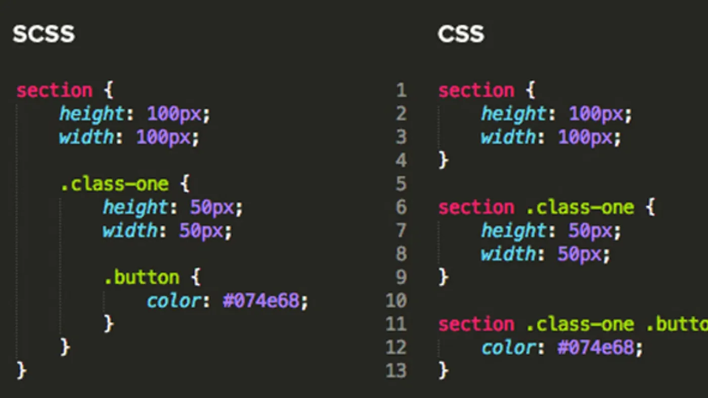

# CSS

## 학습 키워드

- CSS
  - Sass
  - CSS 방법론
  - CSS Modules

<br/>

## CSS

- Cascading Style Sheets
- 웹페이지를 꾸미려고 작성하는 코드

<br/>

### 🌈 CSS의 등장

#### `1990` 문서를 공유하기 위해서 HTML 등장

웹은 문서를 공유하기 위해 만들어졌다. 문서를 만들기 위해 HTML이 등장하게 되었고,
HTML에 서식을 입히기 위해 __태그에 직접 스타일을 입력하는 방식(inline-style)__ 으로 사용되었다.

```html
<div>
  <p>난 문서고, <strong style="color:red">강조하고 싶어!!</strong><p>
</div>
```

#### `1996` CSS 탄생

 __inline-style의__ 문제점으로 인해 CSS가 탄생하게 된다.

- 동일하게 강조하고 싶은 곳에 __매번 동일한 코드를 작성__
- 속성이 변경되는 경우 __일일이 다 바꿔야 하는__ 상황이 발생

```css
/* CSS Ruleset : 선택자(Selector) & 선언(Declaration) */
strong {color:red; text-decoration:underline;}
```

HTML에서 서식을 분리하고 원하는 태그를 선택(Selector)하여 스타일 선언(Declarations)해두는 방식으로 적용할 수 있게 되었다.

<br/>

### 🎨 CSS의 문법의 확장

#### `2006` Sass의 등장

> Sass는 Nested(중첩된) 한 `Selector`와 `variable`를 등록할수 있는 __추가적인 문법으로__ 작성하면 CSS로 변환을 시켜주는 pre-processor(전처리기)이다.



전처리기를 사용해서 Selector의 반복을 줄이고 자주 사용되는 글자크기,색상 등을 변수로 등록하여 사용할 수 있도록 해주었다.
그러나 CSS 파일로 변경해주는 `컴파일러`가 필요하는 단점이 있다.

<br/>

### 🚨 컴포넌트 기반의 App 등장, CSS 구조상의 문제 발생

페이스북의 성장으로 인해 React를 비롯한 Framework가 만들어지면서 __문서 기반이 아닌 컴포넌트 기반의 개발 방식이 자리잡게 되었다.__

문서를 편하게 꾸밀 수 있도록 설계된 CSS는 문서를 꾸미는 데 있어서 유용했지만
__애플리케이션스러운 UI와 모듈과 컴포넌트의 방식의 개발 방식과는 맞지 않았다.__

#### 📌 CSS 설계 방식의 문제점

`Global Scope` : CSS의 속성은 어디서든 선언 가능하며 (ex. inline, style 태그, link 태그로 연결한 파일.. 등) 모든 프로젝트에 영향을 준다.

  > 모든 스타일이 global에 선언되어 중복되지 않는 class 이름을 적용해야 하는 문제

`Specificity` : HTML에서 지정한 class 순서가 아니라 CSS의 순서에 의해 서식 우선순위가 결정됩니다.

> CSS 로드 순서에 따라 스타일이 우선순위가 달라지는 문제

<br/>

### 💡 CSS 문제를 해결해보자

#### `2013` CSS 방법론 (feat.BEM)

> 📖 BEM <br/> Block, Element, Modifier의 줄임말로 CSS 클래스 네이밍 컨벤션 방법론 <br> HTML 요소들을 각각 Block, Element, Modifier 세 가지로 분류해서 작명을 하는 방법론


체계적으로 규칙을 가지고 CSS를 작성을 해야겠다는 필요성에 의해 CSS 방법론들이 등장하게 되었다.
구조를 표현하고 Specificity를 하나로만 관리하여 기존의 문제점을 해결하고자 하는 방식이다.
간결하고 직관적이며 배우기 쉬워서 BEM이 대세가 되었다.  

<br/>

#### `2015` CSS Modules

Selector는 단순화되는 방향으로 진화했지만 여전히 Global Scope 으로 인해 컴포넌트와 CSS간의 구조와 범위를 일치하는 문제가 남아 있었다.
이러한 문제를 해결하려는 첫번째 움직임으로 `CSS Modules`이 등장하였다.

- __CSS Modules__ `CSS를 모듈화` 하여 사용하는 방식이다.
- 번들러가 CSS 클래스에 __해시 문자열을 추가하여 고유한 className을 만들어,__ Scope를 지역적으로 제한할 수 있다.


#### 사용방법

- `.module.css` 확장자를 사용해서 CSS 모듈 파일을 생성

```css
.box{
  background : black; 
  color: white; 
  padding : 2rem; 
}
```

```jsx
import React from "react";
import styles from "./Box.module.css";

function Box() {
  return <div className={styles.box}>{styles.box}</div>;
}
export default Box;
```

#### 장점

- 해시 문자열이 추가 되어 고유한 클래스네임을 갖기 때문에, CSS 클래스가 중첩되는 것을 완벽히 방지할 수 있다.
- css 네이밍 규칙을 간소화 할 수 있다.
- 컴포넌트 단위로 스타일을 관리할 수 있어 유지보수 용이

#### 단점

- 별도의 CSS 파일을 만들어 관리해야 한다.
- 랜더링 과정에서 자동 변환된 클래스명이 코드의 가독성을 저해하는 경우도 있다.

<br/>

## 🔗 참고

- [역사로 알아보는 CSS가 어려워진 이유 : 웹 문서에서 웹 애플리케이션으로](https://yozm.wishket.com/magazine/detail/1319/)
- [역사로 알아보는 CSS가 어려워진 이유 : CSS in JS와 Atomic CSS](https://yozm.wishket.com/magazine/detail/1326/)
- [CSS의 역사 톺아보기 : 그래서 어떤 라이브러리가 좋은데..?](https://velog.io/@lovelys0731/CSS의-역사-톺아보기)
- [BEM](https://nykim.work/15)
