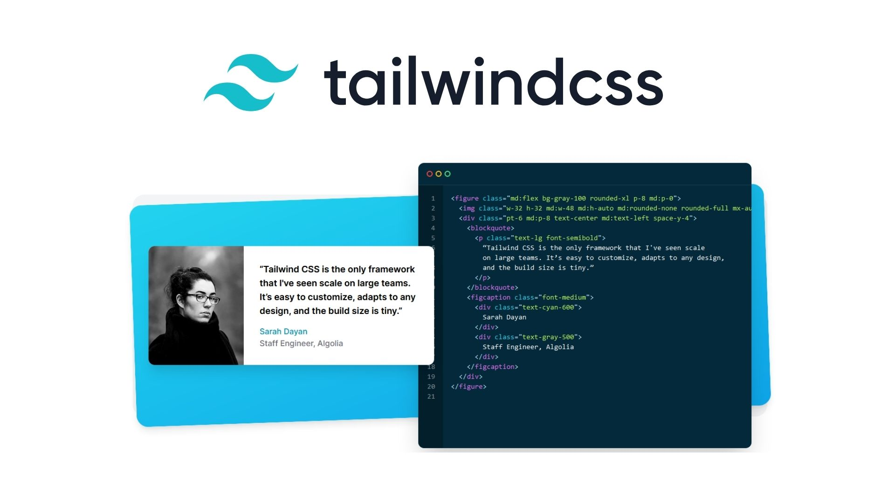

# CSS in JS

## 학습 키워드

- CSS in JS
  - Styled Components
  - Emotion
- Atomic CSS
  - TailwindCss
- Zero-Runtime CSS
  - Vanilla Extract

<br/>

## CSS in JS

### `2016` [CSS in JS](https://en.wikipedia.org/wiki/CSS-in-JS) 등장

> Javascript를 사용하여 구성 요소의 스타일을 지정하는 스타일링 기술

CSS의 Global Scope와 Specificity 문제는 __CSS의 구조상 해결할 수 없는 문제였다.__

🤔 그렇다면 JS를 통해 CSS를 만들게 되면 이러한 문제를 해결할 수 있지 않을까? 하는 생각으로 `CSS in JS` 가 탄생하게 된다.

페이스북 개발자 Vjeux는 다음과 같은 CSS의 7가지 문제점을 제시하면서, 이러한 이슈들을 해결하는 방법으로 CSS-In-JS를 소개했다.

- Global Namespace : 모든 스타일이 Global에 선언되어 중복되지 class 이름을 적용해야 하는 문제
- Dependencies : CSS 간의 의존관계를 관리하기 힘든 문제
- Dead Code Elimination : 기능,추가,삭제 과정에서 불필요한 CSS를 제거하기 어려운 문제
- Minification : 클래스 이름의 최소화 문제
- Sharing Constants : JS 코드와 상태 값을 공유할 수 없는 문제
- Non-deterministic Resolution : CSS 로드 순서에 따라 스타일 우선 순위가 달라지는 문제
- Isolation : CSS와 JS가 분리된 탓에 상속에 따른 격리가 어려운 문제

<br/>

### CSS in JS 특징

#### 📌 runtime

Javascript __runtime에서__ 필요한 CSS를 동적으로 만들어 적용한다.

- 개발자 모드 : `<style>` 태그에 style을 추가하는 방식으로 사용
- 배포 모드 : stylesSheet을 CSSStylesSheet.insertRule 통해 바로 `CSSOM`에 주입한다.

#### 장점

- 지역 스코프 스타일
- 코로케이션 ( 적용되는 컴포넌와 함께 배치 된다.)
- 자바스크립트 변수를 style에 사용 할 수 있다.

#### 단점

- 스타일이 수시로 변경되는 스크롤,드래그 애 드롭 과 같은 복잡한 애니메이션 사용시 스타일 계산 비용이 커지기 때문에 런타임에 오버헤드가 발생 할 수 있다.
- 별도의 라이브러리를 설치하기 때문에 번들 크기가 커진다.

<br/>

#### CSS in JS 라이브러리 :   💅🏻 Styled Components

- JS 파일 안에 컴포넌트 이름을 쓰듯 스타일을 선언하는 방식

```jsx
import styled from 'styled-components';

const Paragraph = styled.p`
  color: #00F;
`;

export default function Greeting() {
  return (
    <Paragraph>
      Hello, world!
    </Paragraph>
  );
}
```

#### [공식문서](https://styled-components.com/docs/basics#motivation)에 따르면, 아래와 같은 기능을 제공한다

- `Automatic critical CSS`
  - 페이지의 컴포넌트를 추적해 필요한 스타일만 삽입한다.
- `No class name bugs`
  - 스타일에 대해 __고유한 클래스 이름을 생성한다.__
- `Easier deletion of CSS`
  - 모든 스타일링이 특정 컴포넌트와 연결된다. 따라서 컴포넌트가 삭제 되면 해당 컴포넌트의 모든 스타일도 함께 삭제된다.
- `Simple Dynamic Styling`
  - props나 global theme에 기반하여 여러 컴포넌트의 스타일을 쉽고 직관적으로 적용할 수 있다.
- `Painless Maintenance`
  - 컴포넌트에 영향을주는 스타일을 찾기 위해 다른 파일을 찾지 않아도 되어 유지 관리가 쉽습니다.
- `Automatic Vendor Prefixing`
  - 자동으로 벤더 프리픽스를 붙여준다.

<br/>

#### CSS in JS 라이브러리 : 👩🏻‍🎤 Emotion

- Styled-Components와 마찬가지로 CSS-In-JS 라이브러리 종류 중 하나
- MUI(Material UI)가 스타일링 엔진을 Emotion으로 채택하면서 이목이 집중되고 있다.

#### 👩🏻‍🎤 Emotion 의 차별점

- css props
  - inline 스타일링 가능, 비교적 네이밍이 간단
- SSR
  - SSR에서 ServerStyleSheet 설정이 필요하지만, Emotion은 SSR에서 별도의 설정 없이 동작한다.

<br/>

## 새로운 CSS 패러다임, Atomic CSS

#### `2017` TailwindCSS

JS가 아닌 CSS 생태계에서 이를 해결하고자 하는 새로운 패러다임으로 CSS 프레임워크
`Utiliy-First`라고 불리는 방식의 TailwindCSS 등장하게 된다.



즉, 부트스트랩과 같이 __미리 세팅된 유틸리티 클래스를 활용하는 방식으로__  Html 태그 내에서 스타일링을 할 수 있다.
미리 정의 된 클래스 네임을 조합해서 스타일링 하는 방식의 `Atomic CSS 패러다임`을 따른다.

#### 장점

- Utility-First의 장점
  - CSS 파일을 별도로 관리해야 할 필요가 없다.
- 모든 곳에서 동일한 유틸리티 클래스 사용해 일관된 스타일을 구현하기 쉽다.
- 로우 레벨의 스타일을 제공하고, 쉽고 자유롭게 커스텀이 가능하다.

#### 단점

- HTML과 CSS의 분리가 되지 않아 코드가 길어지고, 가독성이 떨어짐
- rem 단위가 기본이기 때문에, px단위  서비스라면 기본값을 변경 해야 한다.
- 빌드 타임에 모두 생성되므로 동적 변수를 사용할 수 없어 의존성 라이브러리 설치가 필요하다.

<br/>

## CSS in JS 대유행, Zero-Runtime CSS

2020년 ~ 2021년쯤부터, React의 압도적인 점유율로 인해 CSS-In-JS의 대유행이 시작되었다.
그래서 Runtime CSS in JS의 문제점을 해결하고자 `Zero-Runtime CSS-In-JS` 등장하게 되었다.

### Zero-Runtime CSS-In-JS

- JS Bundle에서 Style코드를 모두 실행되어야 페이지가 로드되는 방식으로 동작
- Runtime에 스타일을 생성하지 않으면서 더 빨리 페이지를 로드 할 수 있다는 장점
  - Build Time에 CSS를 생성해야 하기에 webpack 등 빌드 위한 설정을 따로 해야 한다.

#### `2020` Vanilla Extract

- `CSS Modules-in-TypeScript`
- 빌드타임에 ts파일을 css파일로 만든다.
- type-safe하게 theme를 다룰 수 있다.
- 프론트엔드 프레임워크에 구애받지 않다.
- Tailwind 처럼 Atomic CSS를 구성할 수도 있다.
- Sttitches 처럼 variant 기반 스타일링을 구성할 수 있다.

Vanilla Extract는 기능적으로 높은 확장성을 가지고 있다. Tailwind CSS를 모방한 Sprinkles, Sttiches을 모방한 Recipes , Linaria를 모방한 dynamic을 제공한다. Vanilla Extract의 조금 부족했던 사용성을 채워줘 거의 모든 CSS in JS를 총망라 했다고 볼 수 있다.

<br/>

## 🔗 참고

- [역사로 알아보는 CSS가 어려워진 이유 : 웹 문서에서 웹 애플리케이션으로](https://yozm.wishket.com/magazine/detail/1319/)
- [역사로 알아보는 CSS가 어려워진 이유 : CSS in JS와 Atomic CSS](https://yozm.wishket.com/magazine/detail/1326/)
- [CSS의 역사 톺아보기 : 그래서 어떤 라이브러리가 좋은데..?](https://velog.io/@lovelys0731/CSS의-역사-톺아보기)
- [CSS-in-JS 라이브러리들에 대한 고찰](https://bepyan.github.io/blog/2022/css-in-js)
- [CSS-in-JS 무엇이 다른가요?](https://so-so.dev/web/css-in-js-whats-the-defference/)
- [Vanilla Extract란 무엇인가](https://velog.io/@keumky1/Vanilla-Extract란-무엇인가)
