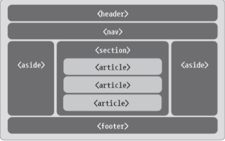
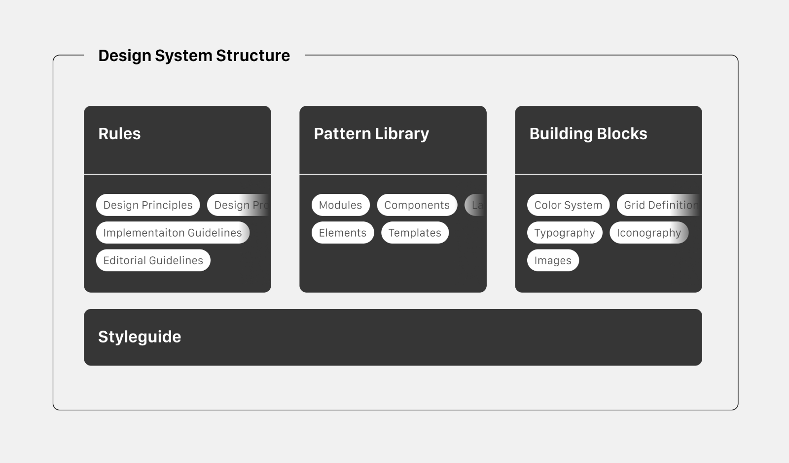

# Design System

## 학습 키워드

- 의미 있는 마크업
- 반응형 웹 디자인(Responsive Web Design)
- 디자인 시스템(Design System)
  - Atomic Design

<br/>

## 의미 있는 마크업

### 시맨틱 태그 (Semantic Tag)

> Semantic : '의미의', '의미론적' 뜻을 가진 형용사

- 의미를 부여한 태그
- Html5 등장하게 된 용어
- 예를 들어 `<Header>`, `<Footer>` 같은 태그들
  - 해당 태그들은 의미를 유추 할 수 있다.

<br/>

### 🤔 왜 시맨틱 태그를 사용해야 하는가?

#### 1. HTML 문서의 가독성과 유지보수가 쉬워지기 때문이다

- 만약 모든 태그들을 `<div>` 태그로만 만들어졌다고 가정해본다면 어디가 어느 부분인지, 어떤 영역인지 한눈에 파악하기 쉽지 않다.

#### 2. 웹 브라우저가 HTML만 보고 상단(Header), 본문(main), 하단(footer), 사이드(aside) 등, 어느 영역인지 쉽게 알 수 있다

- 웹 접근성 시각에서 볼 때도 중요하게 사용된다. 예를 들어 시각장애인들이 사이트를 사용할 때는 화면의 텍스트를 읽어주는 스크린 리더기 등을 통해 활용될 수 있다.

#### 3. 검색엔진이 검색을 수행할 때 HTML내의 태그를 분석 할 수 있다

- 예를 들자면 검색엔진의 검색로봇에서는 `<article>` 태그가 사용된 콘텐츠를 재배포 할 수 있는 콘텐츠로 인식한다. 반대로 `<section>` 태그로 묶은 콘텐츠는 재배포를 금지하는 콘텐츠로 인식한다.

<br/>

### 시맨틱 태그의 종류




#### `<Header>`

- [header](https://developer.mozilla.org/ko/docs/Web/HTML/Element/header)
- 웹사이트의 도입부
- 사이트의 로고나 제목 등을 기술할 때 사용

#### `<main>`

- [main](https://developer.mozilla.org/ko/docs/Web/HTML/Element/main)
- 메인 콘텐르를 나타낼 때 사용
- 반드시 한번만 사용되어야 한다.
- 문서의 중심이 되는 주제나 확장되는 콘텐츠로 구성

#### `<hgroup>`

- [hgroup](https://developer.mozilla.org/ko/docs/Web/HTML/Element/hgroup)
- 제목과 부제목을 묶어서 나타내 주는 요소
- 페이지 전체 구조에 대한 개념으로 쉽게 눈에 들어오게 하는 역활을 담당

```html
<section>
  <hgroup>
    <h1>제목 h1</h1>
    <h2>소제목 h2</h2>
  </hgroup>
</section>
```

#### `<nav>`

- [nav](https://developer.mozilla.org/ko/docs/Web/HTML/Element/nav)
- 내비게이션 표현을 위한 태그
- 동일한 사이트 안의 문서나 다른 사이트의 문서로 연결하는 링크들의 모음

#### `<footer>`

- [footer](https://developer.mozilla.org/ko/docs/Web/HTML/Element/footer)
- 일반적으로 웹 문서 끝자락에 들어가는 태그
- 보통 저작권 정보나 저작권 표기와 같은 내용이 들어가는 태그

#### `<aside>`

- [aside](https://developer.mozilla.org/ko/docs/Web/HTML/Element/aside)
- 왼쪽이나 오른쪽에 부수적인 내용이 들어가는 부분
- 웹 페이지의 주 내용이 아닌 왼쪽이나 오른쪽에 하단에 사용되는 내용들이 들어가는 태그

#### `<article>`

- 웹페이지 상에서의 실제 내용을 의미
  - 보통 블로그의 포스트나 웹사이트의 내용, 사용자가 등록한 코멘트, 독립적인 웹 콘텐츠 항목 등
  - 한마디로 정의하자면 태그를 적용한 부분을 떼어 내 독립적으로 배포하거나 재사용하더라도 완전히 하나의 콘텐츠가 된다면 해당 태그를 사용

#### `<section>`

- 여러 가지 콘텐츠들을 그룹으로 묶어주는 역할을 담당
  - 문맥 흐름 중에서 콘텐츠를 주제별로 묶을 때 사용하며 그 안에는 섹션 제목을 나타내는 `<h1> ~ <h6>` 태그들이 함께 사용
- 재배포할 수 없는 콘텐츠로 인식

<br/>

### 🤔 의미 있는 마크업을 작성하는 이유?

웹 접근성 가이드라인을 모두 완벽하게 만드는것은 사실상 불가능하다. 하지만 가이드라인을 준수하여 더 많은 사람들에게 사이트의 접근성을 높여주고, 이용할 수 있도록 하기 때문에 모든 사람들이 차별받지 않고 인터넷상의 정보를 습득할 수 있도록 한다.

웹은 점점 규모가 커지고, 의미 있는 내용을 추리하는데 더 많은 시간과 자원을 사용한다. 정확하고 가치있는 정보를 탐색하기 위해서는 웹문서가 단순한 코드의 나열이 아니라 __의미를 가진 하나의 구조로 동작해야 한다.__
단순히 정보가 나열된 문서는 중요한 요소를 구분하기 어렵다. 자칫 크롤러가 엉뚱한 부분을 중요하다고 착각하는 요인이 될 수 있다. 우리가 웹페이지를 구성할 때 적절한 위치에 적합한 요소를 사용해야 이런 오해를 줄일 수 있다.

__⇒ 시맨틱태그를 이용해서 의미를 구분할 수 있는 문서를 만들어야 사용자에게 정확한 정보를 제공할 수 있다.__

<br/>

#### 📌 React 접근성을 고려하기 위해 `<Fragment>` 사용을 권장한다

```jsx
import React, { Fragment } from 'react';

function ListItem({ item }) {
  return (
    <Fragment>
      <dt>{item.term}</dt>
      <dd>{item.description}</dd>
    </Fragment>
  );
}

export default function Glossary(props) {
  return (
    <dl>
      {props.items.map(item => (
        <ListItem item={item} key={item.id} />
      ))}
    </dl>
  );
}
```

> ✅ 컴포넌트를 분리하기 위해 `<div>` 태그를 남발하고 있지 않는지 꼭 확인하자! <br/>
컴포넌트를 그룹화 하면서 시맨틱 태그를 잘 사용하고 있는지도 꼭 확인하자!

<br/>

## [반응형 웹 디자인(Responsive Web Design)](https://developer.mozilla.org/ko/docs/Learn/CSS/CSS_layout/Responsive_Design)

> 반응형 웹 설계는 웹페이지가 모든 화면 크기와 해상도에서 잘 렌더링되도록 하면서도 사용성을 보장하는 웹 디자인 접근 방식이다.

모든 디바이스에서 일관된 사용자 경험을 제공하며, 사용자가 스마트폰, 태블릿, 노트북, 데스크톱 등 다양한 환경에서 웹사이트를 이용할 수 있도록 도와준다.

<br/>

### 🤔 반응형 웹 디자인의 왜 중요할까?

#### 1. 다양한 디바이스 사용으로 인해 사용성 향상

스마트폰, 태블릿, 데스크톱, 노트북 등 각각의 화면 크기와 해상도가 다릅니다. 반응형 디자인은 모든 디바이스에서 __일관된 사용자 경험을 제공하여__ 사용자들이 어떤 환경에서든 웹사이트를 편리하게 이용할 수 있도록 돕는다. 이로써 콘텐츠에 더욱 쉽게 접근할 수 있다.

#### 2. 통일된 디자인

모든 화면 크기에서 같은 디자인과 레이아웃을 유지하면 브랜드 일관성을 유지할 수 있다. 사용자들은 어떤 디바이스에서 웹사이트를 방문하더라도 브랜드의 감각을 느낄 수 있다.

#### 3. 비용 효율성

별도의 모바일 버전을 개발하거나 관리하는 대신, 반응형 디자인을 사용하면 하나의 웹사이트로 모든 디바이스를 대응할 수 있다. 이로써 개발 및 유지보수 비용이 줄어든다.

#### 4. SEO 향상

구글과 같은 검색 엔진은 모바일 친화적인 웹사이트를 선호하며, 이를 검색 결과 순위에 반영한다.

### ✍🏻 정리

반응형 웹 디자인은 __다양한 디바이스에서 일관된 사용자 경험을 제공하며__ SEO 향상, 비용 효율성, 사용성 향상 등 다양한 이점을 제공한다.

<br/>

## 디자인 시스템 (Design System)

> 다양한 페이지와 채널을 걸쳐 공통의 언어와 시각적 일관성을 만들고 반족되는 작업을 줄임으로써, 규모에 맞게 디자인을 관리하기 위한 표준 집합이다.

- 결과물들의 집합
- 전체 조직 구성원을 대상으로 '제품을 만드는 방법'을 의미



<br/>

<br/>

### 🤔 왜 디자인 시스템에 대해 알아야 할까?

> Summary: A design system is a set of __standards__ to manage design __at scale__ by __reducing redundancy__ while creating a __shared language__ and __visual consistency__ across different pages and channels.

> Definition: A design system is a complete set of standards intended to manage design at scale using __reusable components and patterns.__

 스타일 가이드 + 컴포넌트 라이브러리  = 디자인 시스템

- `스타일 가이드` 어떤 서비스에 들어간 모든 디자인 요소들을 정의한 문서를 의미 (Theme)
- `컴포넌트 라이브러리` 스타일 가이드에 있는 디자인을 재활용 가능한 코드로 만들어 놓은것 (Component)

두가지를 개념을 활용하기 위해서 알아야 한다.

<br/>

### 디자인 시스템의 목적

제품을 처음 만들 때는 초기에 세운 규칙들이 잘 이행되고 반영된다. 하지만 시간이 지날수록 이런 규칙들이 어긋나고 점차 사라지는 등 불협화음이 필연적으로 발생한다. 새로운 프로젝트 구성원과 팀이 관여하고, 다양한 플랫폼에 걸쳐 프로젝트가 확장되면 이러한 현상은 가속되며 결국 제품의 사용자 경험에 큰 영향을 미칠 수 있다.

이러한 혼란은 방지하고 질서를 세우는 역활을 하는 것이 `디자인 시스템` 이다. 어떤 제품을 만들 때 표준 규칙을 세우고 이에 따라 작업을 효율적이고, 일관되며, 나아가 확장 할 수 있도록 한다.

<br/>

### 디자인 시스템의 장점

#### 효율성 확보

디자인 시스템을 사용하면 반복되는 요소들을 매번 새로 만들 필요 없다. 재사용 가능한 컴포넌트, 패턴 등을 이용해 작업의 효율성을 높일 수 있으며, 전체 제품 개발에 필요한 시간을 단축하여 더욱 빠르게 시장에 제품을 출시할 수 있다.

#### 일관성 있는 사용자 경험

디자인 시스템의 표준 규칙과 원칙에 따라 서로 다른 페이지나 플랫폼을 걸쳐 일관된 사용자 경험을 구축할 수 있다. 반복되는 컴포넌트 제작에 소비되는 시간을 아껴서 사용자에게 더 집중할 기회를 만들 수 있다.

#### 다양한 제품에 대응

디자인 시스템을 통해 효율성과 일관성을 확보함으로써 다양한 규모의 제품들을 빠르고 쉽게 만들 수 있다.

#### 협업에 기여

디자인 시스템은 디자이너, 개발자, 프로젝트 매니저 등 프로젝트팀 구성원 사이의 지식 격차를 줄이고 공통의 원칙을 숙지하여 협업에 기여할 수 있다. 이를 통해 프로젝트 구성원이 함께 학습하고 성장할 수 있으며, 결국 프로젝트의 생산성 향상으로 이어진다.

<br/>

### 디자인 시스템 사례

- [Atlassian Design System](https://atlassian.design/) : Jira, Trello, Bitbucket, Sourcetree를 운영하는 회사
- [Material Design (Google)](https://m3.material.io/)
- [LINE Design System](https://designsystem.line.me/)

<br/>

### 디자인 시스템 Gallery

- [Design Systems Gallery](https://designsystemsrepo.com/design-systems/)
- [Design Systems](https://www.designsystems.com/open-design-systems/)

<br/>

### [Atomic Design](https://bradfrost.com/blog/post/atomic-web-design/)

> Atomic design is methodology for creating design systems.

- 디자인 시스템을 만들기 위한 방법론

<br/>

## 🔗 참고

- [시맨틱 태그(Semantic Tag)란 무엇인가?](https://coding-factory.tistory.com/883)
- [의미 있는 마크업 작성하기](https://medium.com/wantedjobs/의미있는-마크업-작성하기-4de54866ae6b)
- [React 공식문서 함께 읽기 - 접근성](https://velog.io/@ichbinmin2/TIL-0802-React-공식문서-함께-읽기-접근성)
- [처음부터 웹표준과 접근성을 고려했다면?](https://youtu.be/FGM8gvHw-Js?si=HINmfTb8Abwu4Vmo)
- [반응형 웹디자인이란 무엇이고 왜 중요할까?](https://www.designkits.co.kr/blog/web-design/Responsive-design-important)
- [디자인 시스템이란 무엇인가](https://devocean.sk.com/blog/techBoardDetail.do?ID=163710)
- [디자인 시스템의 정의와 필요성](https://simsimjae.medium.com/디자인-시스템의-정의와-필요성-2d76d424ac03)
