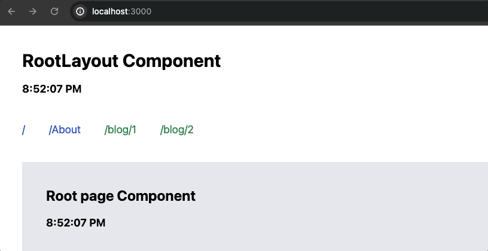

# Caching

## 학습키워드

- Router Cache
- Full Route Cache
- Request Memoization
- Data Cache

<br/>

## [Caching](https://nextjs.org/docs/app/building-your-application/caching#router-cache)

> 📖 캐시 : 컴퓨터 과학에서 데이터나 값을 미리 복사해 놓은 임시 장소

> 📖 캐싱 : 어떤 데이터를 한번에 받아온 후에 그 데이터를 불러온 저장소보다 가까운 곳에 임시로 저장하여, 필요시 더 빠르게 불러와서 사용하는 프로세스

Next.js는 성능을 향상시키고 비용을 절감하기 위해 최대한 캐시한다. **경로는 정적으로 렌더링 되고, 데이터 요청은 캐시 된다는것을 의미한다.**


<br/>

### Router Cache

Next.js에는 사용자 세션 동안 개별 경로 세그먼트로 분할된 `React Server Component Payload(RSC Payload)`를 저장하는 in-memory를 클라이언트 측, 캐시를 의미한다.


> `http://localhost:3000/a`라는 페이지 요청을 하면 `Router Cache`는 해당 페이지의 캐시기록을 확인하다. Miss로 판단하게 되면 캐시하기 위한 절차를 진행한다. `http://localhost:3000/b`라는 페이지를 요청하면 `Router Cache`는 해당 페이지의 캐시기록을 확인하고 Miss로 판단하게 되면 캐시하기 위한 절차를 진행한다. 다시 `http://localhost:3000/a` 라는 페이지를 요청하면 `Router Cache`는 해당 페이지의 캐시기록을 판단하고, 기록이 있다면(HIT) 페이지를 다시 로드 하지 않고, React와 브라우저 상태를 캐싱한 컨텐츠를 사용자에게 보여준다.

사용자가 라우트간을 이동하는 동안 Next.js가 방문한 라우트 세그먼트를 캐시하고, 사용자가 이동할 가능성이 있는 경로를 미리 가져옴으로서 사용자의 네비게이션 경험을 향상시킨다.

<br/>

#### ⏰ Router Cache 지속시간

캐시는 브라우저의 임시 메모리에 저장된다. 라우터 캐시의 지속시간을 결정하는 두가지 요소는 다음과 같다.

- `Session` : 캐시는 탐색 전반에 걸쳐 지속된다. 그러나 **새로고침** 하면 지워진다.
- `자동 무효화 기간` : 개별 세그먼트의 캐시는 **특정시간이 지나면 자동으로 무효화 된다.** 이기간은 경로가 정적으로 동적으로 렌더링 되는지에 따라 달라진다.
  - 동적으로 렌더링 된 경우 : 30초
  - 정적으로 렌더링 된 경우 : 5분

> ⚠️ 개별 세그먼트가 마지막으로 엑세스 되거나 생성된 시간부터 영향을 받는다.

<br/>

#### 👩🏻‍💻 예제를 통해 라우터 캐시 작동 방식을 이해보자

```
app
├── layout.tsx
├── page.tsx
├── about → 정적경로
│   └── page.tsx
└── blog
    └── [id] → 동적경로
        └── page.tsx
```

```jsx
// 📂 app/layout.tsx
export default function RootLayout({
  children,
}: Readonly<{
  children: React.ReactNode,
}>) {
  return (
    <html lang="en">
      <body className="p-10">
        <h1 className="text-3xl font-bold mb-4">RootLayout Component</h1>
        <p className="mt-4 text-lg font-bold mb-10">
          {new Date().toLocaleTimeString()}
        </p>
        <nav className="flex gap-10 mb-10">
          <Link className="text-lg text-blue-700 " href={'/'}>
            /
          </Link>
          <Link className="text-lg text-blue-700" href={'/about'}>
            /About
          </Link>
          <Link className="text-lg text-green-700" href={'/blog/1'}>
            /blog/1
          </Link>
          <Link className="text-lg text-green-700" href={'/blog/2'}>
            /blog/2
          </Link>
        </nav>
        {children}
      </body>
    </html>
  );
}
```

> RootLayout.tsx 파일에는 `<Link>`컴포넌트를 사용해서 경로이동이 가능하도록 지정해두었다.

```jsx
// 개별세그먼트
// 📂 /about
// 📂 /blog/[id]
export default function page() {
  return (
    <section className="bg-gray-200 p-10">
      <h1 className="text-2xl font-bold">About page Component</h1>
      <p className="mt-4 text-lg font-bold">
        {new Date().toLocaleTimeString()}
      </p>
    </section>
  );
}
```

> /about, /blog/:id 정적경로와 동적경로를 지정한 페이지를 생성해두었고, 해당 페이지가 로드되면 현재 시간을 출력하도록 구현했다.



> 🧪 Router Cache가 적용되어, RootLayout의 컴포넌트에 적용된 시간은 캐싱되어 다른 경로 이동시 현재 시간을 보여주는게 아니라, 첫 RootLayout의 컴포넌트 렌더링시 출력되었던 시간을 유지해서 보여준다.

<br/>

### Full Route Cache

- Next.js에서 `라우트의 렌더링 결과를 캐시`하여 서버에서 클라이언트로의 반복적인 렌더링 요청을 줄이고, 페이지 로드 성능을 향상시킨다.


#### ✅ Full Route Cache vs Route Cache 차이점

- 라우터캐시 : 사용자 세션 동안 브라우저에 React 서버 구성요소 페이로드를 임시로 저장한다. 정적 및 동적으로 렌더링된 경로 모두 적용된다.

- 전체 경로 캐시 : 여러 사용자 요청에 걸쳐 서버에서 React 서버 구성요소 페이로드와 HTML을 지속적으로 저장한다. `빌드 또는 재검증 중에 정적으로 렌더링된 경로만 캐시한다.`

> ⭐️ 전체라우트캐시(Full Route Cache)는 서버측에서 페이지의 HTML렌더링 결과를 캐시하고, 라우터 캐시(Router Cache)는 클라이언트측에서 사용자가 방문한 경로 세그먼트를 캐시하여 사용자의 경로 이동을 더 빠르게 만든다.

<br/>

### Request Memoization

React는 `fetch`API를 확장하여 **동일한 URL과 옵션을 가진 요청을 자동으로 메모한다.** 이는 React 컴포넌트 트리의 여러 위치에 동일한 데이터에 대한 가져오기 함수를 한번만 실행하면서 호출할 수 있음을 의미한다.
React 컴포넌트가 `렌더링되는 동안`에만 캐시된 데이터를 사용하여 성능을 향상시키고, 중복된 요청을 방지하기 위해 사용된다.

> 일반적으로 페이지를 렌더링할 때 서버에서 데이터를 가져와야 하는데, 이를 여러 컴포넌트에서 중복해서 요청하는 것은 비효율적일 수 있다. 따라서 한번 요청된 데이터를 캐시하여 여러 컴포넌트에서 재사용할 수 있게 한다.


- route을 렌더링하는 동안, 처음 특정한 요청이 호출되면 그것의 결과는 메모리에 저장되지 않고 cache된다. `MISS`
- 함수가 실행되고 외부 소스에서 데이터를 가져와 결과가 메모리에 저장된다.`SET`
- 동일한 랜더 경로에서 요청의 후속 함수 호출은 캐시가 되며 `HIT`(데이터는 함수르 실행하지 않고) 메모리에서 반환된다.
- route가 렌더링 되고, 렌더링 패스가 완료되면 메모리가 '재설정'되고, 모든 요청 메모 항목이 지워진다.
  - 이전 요청에 대한 캐시를 유지하는 것은 메모리를 낭비하고, 불필요한 데이터를 유지하는 것 일 수 있다. 특히 React 에서는 렌더링과 관련된 상태와 데이터를 최신 상태로 유지하는 것이 중요하다. 따라서 다음 요청에 대한 메모이제이션을 위해 새로운 공간을 확보한다.

> 🗑️ Request Memoization은 페이지 렌더링을 위한 것이므로 페이지가 렌더링 된 후에는 비워준다

#### 📌 참고사항

- Request Memoization은 `fetch 요청의 GET 메서드`에만 적용된다.
- Request Memoization은 React 구성 요소 트리(React Component tree)에만 적용된다.
  - 메타데이터 생성, 정적 매개변수, 레이아웃, 페이지 및 기타 서버 구성요소 생성에서 요청을 가져오는 데 적용
  - Route Handler의 가져오기 요청은 React 구성 요소 트리의 일부가 아니므로 적용되지 않는다.

#### 👩🏻‍💻 예제를 통해 Request Memoization 작동 방식을 이해보자


```jsx
// 📂 /about
export default async function page() {
  const posts = await (await fetch('http://localhost:4000/posts')).json();
  const blogs = await (await fetch('http://localhost:4000/blogs')).json();
  return (
    <section className="bg-gray-200 p-10">
      <h1 className="text-2xl font-bold">About page Component</h1>
      <p className="mt-4 text-lg font-bold">
        {new Date().toLocaleTimeString()}
      </p>
      <p className="mt-4 text-lg font-bold">Posts</p>
      <pre>{JSON.stringify(posts, null, 2)}</pre>
      <p className="mt-4 text-lg font-bold">Blogs</p>
      <pre>{JSON.stringify(blogs, null, 2)}</pre>
    </section>
  );
}
```

> `/about` 페이지는 fetch API를 두번 요청한다. 페이지가 렌더링 되면서 `http://localhost:4000/posts` 요청 Call은 `/`페이지에서 렌더링시 메모이제이션 되어 서버로 부터 요청하지 않고, `http://localhost:4000/blogs` API Call을 요청해서 렌더링한 화면을 보여준다.

<br/>

### Data Cache

Next.js에서는 들어오는 서버 요청 및 배포 전반에 걸쳐 데이터 가져오기 결과를 유지하는 내장 데이터 캐시가 있다. Next.js가 기본 `fetch`API를 확장하여 서버의 각 요청이 자체 **영구 캐싱 의미를** 설정할 수 있도록 하기 때문에 가능하다.

> fetch 요청을 받은 결과(Data)값을 캐시 처리하는데, 재검증하거나 선택해제 하지 않는 한 들어오는 요청 및 배포 전반에 걸쳐 지속된다.


- 처음 렌더링 중에 fetch 요청이 호출되면, Next.js는 캐시된 응답을 확인하기 데이터 캐시를 확인한다.
- 캐시된 응답이 발견되면 즉시 반환되고, 메모이제이션된다. 캐시된 응답이 발견되지 않으면 데이터 소스로 요청이 이루어지고, 결과가 데이터 캐시에 저장되고 메모이제이션 된다.
- 캐시되지 않은 데이터의 경우(예: { cache: 'no-store' }), 항상 데이터 소스에서 결과를 가져와 메모이제이션된다.
- 데이터가 캐시되든,캐시되지 않든 관계없이 요청은 React 렌더 패스 중에 동일한 데이터에 대한 중복을 피하기 위해 항상 메모이제이션 한다.

#### ✅ Request Memoization vs Data Cache 차이점

- 지속성
  - Request Memoization : 요청의 수명 동안만 지속된다. 한번의 요청에서 다음요청으로의 메모이제이션 데이터는 유지 되지 않는다.
  - Data Cache : 수신 요청 및 배포를 거쳐도 지속된다. 즉, 이전에 캐시된 데이터는 여려 요청 및 서버 배포간에 유지된다.

> 🧐 하나의 요청 동안 유효한 `Request Memoization` 다르게 `Data Cache`는 일정시간 동안 웹 서버로 들어오는 모든 요청에 대해 동작한다. 만약 **next.revalidate** 를 1초로 설정했다면, 1초에 1000명의 사용자가 접속해도 실제 API 요청은 1회 전송된다.

- 네트워크 교차점

  - Request Memoization : 동일한 렌더일 패스(렌더링하는 중)내의 `중복 요청 수`를 줄일 수 있다.
  - Data Cache : `원본 데이터 소스에 대한 요청수`를 줄일 수 있다.

> 🤔 이해보자면, Request Memoization는 하나의 API Call에 대한 중복 요청수를 줄일 수 있고, Data Cache는 여러 API Call을 관리하는데, 각각의 API Call에 대한 요청수를 줄일 수 있다는 말로 우선 이해했다.

<br/>

#### ⚖️ 재검증

- `시간 기반 재검증` : 일정시간이 지난 후 새로운 요청이 발생한 후 데이터를 재검증

```jsx
fetch('https://...', { next: { revalidate: 3600 } });
```


> 🚨 revalidate 시간이 지나더라도 첫 요청은 캐싱된 값을 (STALE 상태여도) 반환한다는 것이다. 반환 후 백그라운드에서 API를 호출해서 값을 업데이트하는데, 개발자 의도와 다르게 동작할 수 있기 때문에 캐시를 적용할 때 주의가 필요하다.

- `주문형 재검증` : 이벤트를 기반으로 데이터를 재검증
  - 필요에 따라 경로( revalidatePath) 또는 캐시 태그( revalidateTag)를 통해 데이터의 유효성을 재검증

```jsx
fetch('https://...', { next: { tags: ['a'] } });
```


<br/>

#### Optiong Out

개별 데이터 fetch의 경우, 캐시 옵션을 no-store로 설정하여 캐싱에서 제외할 수 있다.

```jsx
// Opt out of caching for an individual `fetch` request
fetch(`https://...`, { cache: 'no-store' });
```

<br/>

## 👩🏻‍💻 정리

Next.js는 애플리케이션의 성능을 향상하고 비용을 절감하기 위해 렌더링 작업과 데이터 요청을 캐싱합니다. Next.js의 캐싱 메커니즘은 4가지로 이루어져 있습니다.

- 첫 번째 Router Cache는 클라이언트 측에서 사용자가 페이지를 이동하는 동안 방문한 페이지(라우트 세그먼트)를 캐시하고, 사용자가 이동할 가능성이 있는 경로를 미리 가져옴으로써 사용자의 내비게이션 경험을 향상합니다. Router Cache는 페이지가 새로고침 되거나, 정적 또는 동적 경로에 의해 지정되는 특정 시간이 지나면 자동으로 캐싱 처리를 무효화 합니다.

- 두 번째 Full Route Cache는 빌드시 정적으로 렌더링 된 경로만 HTML 렌더링의 결과를 캐시 하여 서버에서 클라이언트로의 반복적인 렌더링 요청을 줄이고 페이지 로드 성능을 향상합니다.

- 세 번째 Request Memoization은 하나의 페이지가 렌더링하는 동안 동일한 URL과 옵션을 가진 요청을 자동으로 메모이제이션 합니다. 동일한 데이터에 대한 요청 함수를 여러 곳에서 호출해야 할 때 한 번만 실행하여 결괏값을 캐싱하여 중복된 요청을 방지하기 위해 사용됩니다. fetch 요청의 GET 메서드에서만 적용됩니다.

- 네 번째 Data Cache는 fetch API를 확장하여 서버의 각 요청 받은 결괏값(데이터)을 서버 요청 및 배포 간에 유지하는 내장된 캐시입니다. 재검증하거나 옵션을 변경하지 않는 한 들어오는 요청 및 배포 전반에 걸쳐 영구적으로 요청받은 결괏값이 지속됩니다. 적절하게 캐싱 처리를 무효화 해야 합니다. 일정 시간이 지난 후 새로운 요청이 발생하면 데이터를 재검증하는 시간 기반으로 검증하는 방식이 있고, 필요에 따라 경로(revalidatePath) 또는 태그(revalidateTag)를 이벤트와 연결하여 데이터의 유효성을 검증하는 방식이 있습니다. 개별적인 요청의 경우에는 캐시 옵션을 no-store(예: { cache: 'no-store' })로 설정하여 캐싱에서 제외할 수도 있습니다.

<br/>

## 🔗 참고

- [프론트엔드 개발자가 알아야할 '캐싱' 개념정리](https://yozm.wishket.com/magazine/detail/2341/)
- [Next.js cache](https://velog.io/@j_wisdom_h/Next.js-cache)
- [Next.js 캐싱으로 웹 서버 성능 최적화](https://fe-developers.kakaoent.com/2024/240418-optimizing-nextjs-cache/)
