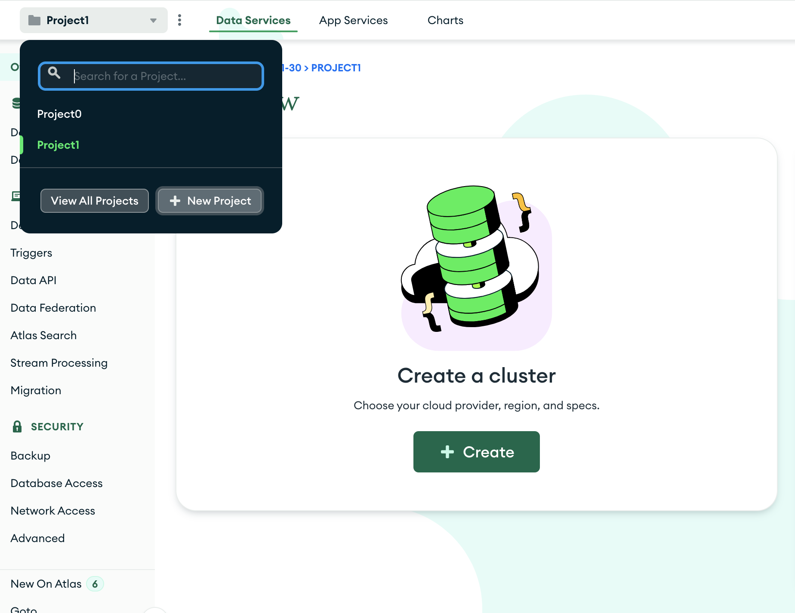
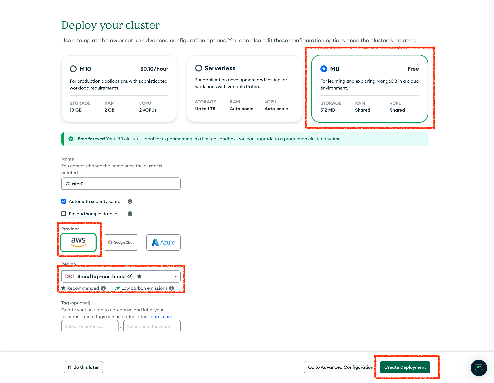
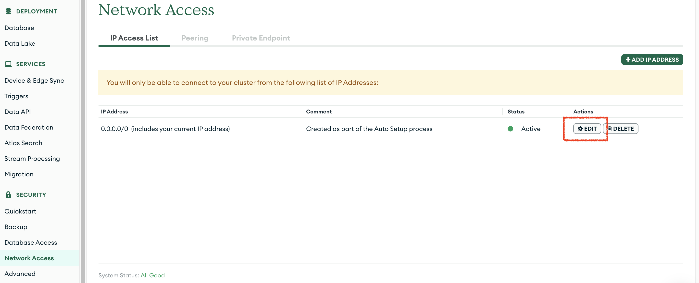
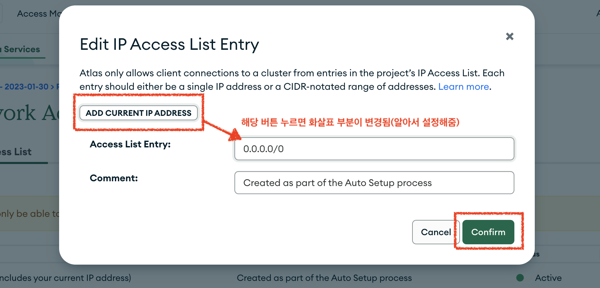
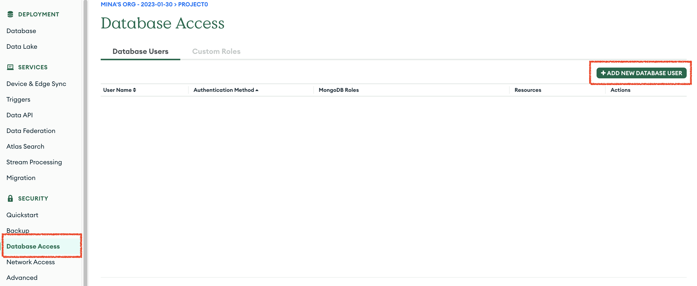
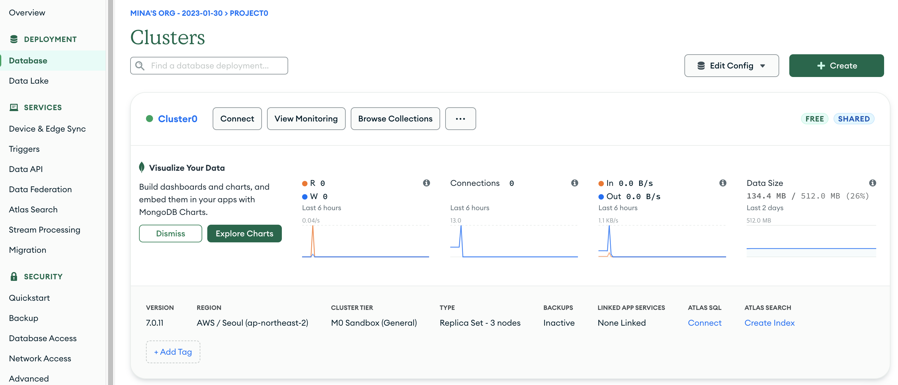
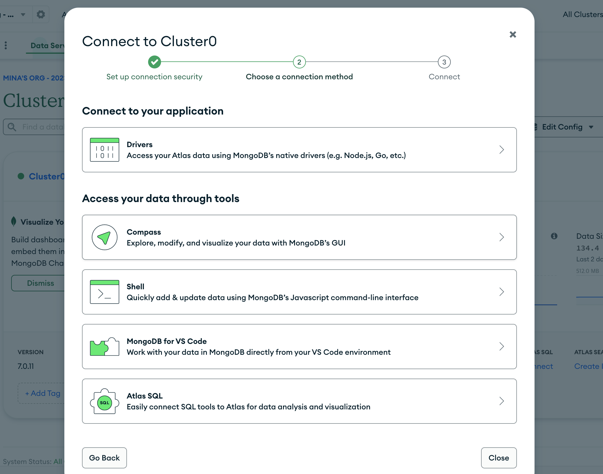
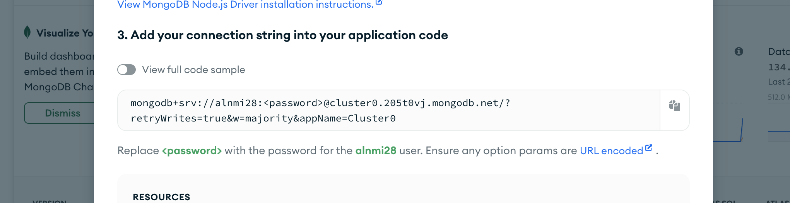

# MongoDB

## 학습키워드

- 초기 설정
- 환경변수 설정
- MongoDB + mongoose

<br/>

### ⚙️ 초기 설정

#### Step1. Project 생성



#### Step2. cluster 생성


#### Step3. cluster 생성시 선택사항



#### Step4. Network Access 변경

- 이미지의 표시된 버튼 클릭하면 팝업 노출 됨



#### Step5. Network Access 변경

- 이미지의 표시된 버튼 클릭하면 변경 후 확인 버튼 클릭



#### Step6. Database Access 생성



#### Step7. Database Access 작성

- 아이디
- 비밀번호 작성(@ 기호는 사용하면 안됨)
- Role SelectBox 선택


<br/>

### 📄 환경변수

- `.env` 파일에 작성할 환경변수 찾는 방법
- `connect` 버튼 클릭



- `Drivers` 영역 선택



- 해당영역 코드 복사해서 환경변수에 지정



```
MONGODB_URL=복사한 코드

mongodb+srv://alnmi28:<비밀번호작성>@cluster0.205t0vj.mongodb.net/<DB명작성>?retryWrites=true&w=majority&appName=Cluster0
```

<br/>

### 🍃 mongoose

#### mongoose 패키지 설치

```shell
npm i mongoose
```

#### DB 폴더 및 파일 생성

- src/lib/db.ts 생성

```typescript
import mongoose from 'mongoose';

const connectDB = async () => {
  try {
    if (mongoose.connection.readyState >= 1) {
      console.log('Already connected to MongoDB');
      return;
    }
    await mongoose.connect(process.env.MONGODB_URL as string);
    console.log(`MongoDB Connected`);
  } catch (error) {
    console.error(`Error: ${error}`);
    process.exit(1);
  }
};
export default connectDB;
```

#### schema 폴더 및 파일 생성

- src/lib/schema.ts 생성
- DB의 schema 사용하기 위한 선언
- [📄 schematypes 공식문서](https://mongoosejs.com/docs/schematypes.html)

```typescript
import mongoose from 'mongoose';
const userSchema = new mongoose.Schema(
  {
    name: { type: String, required: true },
    email: { type: String, required: true },
    password: { type: String, select: false },
    role: {
      type: String,
      enum: ['user', 'admin'],
      default: 'user',
    },
    authProviderId: { type: String }, // 소셜 로그인 로그인
  },
  { timestamps: true }
);

export const User = mongoose.models?.User || mongoose.model('User', userSchema);
```

```
타입 지정 (Type)

String, Number, Date, Buffer, Boolean, Mixed, ObjectId, Array, Decimal128, Map, Schema.Types
예: { name: String }
필수 항목 (required)

필드가 필수인지 여부를 지정합니다.
예: { name: { type: String, required: true } }
기본값 (default)

필드의 기본값을 지정합니다.
예: { age: { type: Number, default: 0 } }
유일성 (unique)

필드 값이 유일해야 함을 지정합니다.
예: { email: { type: String, unique: true } }
인덱스 (index)

필드에 인덱스를 생성합니다.
예: { email: { type: String, index: true } }
유효성 검사 (validate)

필드 값에 대한 유효성 검사를 지정합니다.
예: { age: { type: Number, validate: value => value >= 0 } }
길이 제한 (maxlength, minlength)

문자열 필드의 최대/최소 길이를 지정합니다.
예: { name: { type: String, maxlength: 50 } }
열거형 (enum)

문자열 필드가 가질 수 있는 값들을 제한합니다.
예: { role: { type: String, enum: ['user', 'admin'] } }
일치 (match)

문자열 필드가 정규표현식에 맞아야 함을 지정합니다.
예: { email: { type: String, match: /.+\@.+\..+/ } }
맞춤 메시지 (custom error messages)

유효성 검사 실패 시 사용자 정의 오류 메시지를 설정합니다.
예: { age: { type: Number, min: [18, 'Too young'] } }
```

#### 📌 참고 예제

```typescript
const mongoose = require('mongoose');
const { Schema } = mongoose;

// 사용자 스키마 정의
const userSchema = new Schema({
  // 문자열 타입 필드, 필수 입력, 최대 길이 100자
  name: {
    type: String,
    required: true,
    maxlength: 100,
  },
  // 이메일 필드, 필수 입력, 유일해야 하며 정규 표현식을 통해 이메일 형식 검사
  email: {
    type: String,
    required: true,
    unique: true,
    match: /.+\@.+\..+/,
  },
  // 나이 필드, 최소 18세, 최대 65세, 유효성 검사 실패 시 맞춤 오류 메시지
  age: {
    type: Number,
    min: [18, 'Must be at least 18'],
    max: [65, 'Must be at most 65'],
  },
  // 역할 필드, 'user' 또는 'admin'만 허용, 기본값은 'user'
  role: {
    type: String,
    enum: ['user', 'admin'],
    default: 'user',
  },
  // 생성 날짜 필드, 기본값은 현재 시간
  createdAt: {
    type: Date,
    default: Date.now,
  },
  // 수정 날짜 필드, 기본값은 현재 시간
  updatedAt: {
    type: Date,
    default: Date.now,
  },
});

// 모델 생성
const User = mongoose.model('User', userSchema);

module.exports = User;
```

#### 모델을 사용하기 위한 메서드

- 🔗 [공식문서](https://mongoosejs.com/docs/api/model.html)
