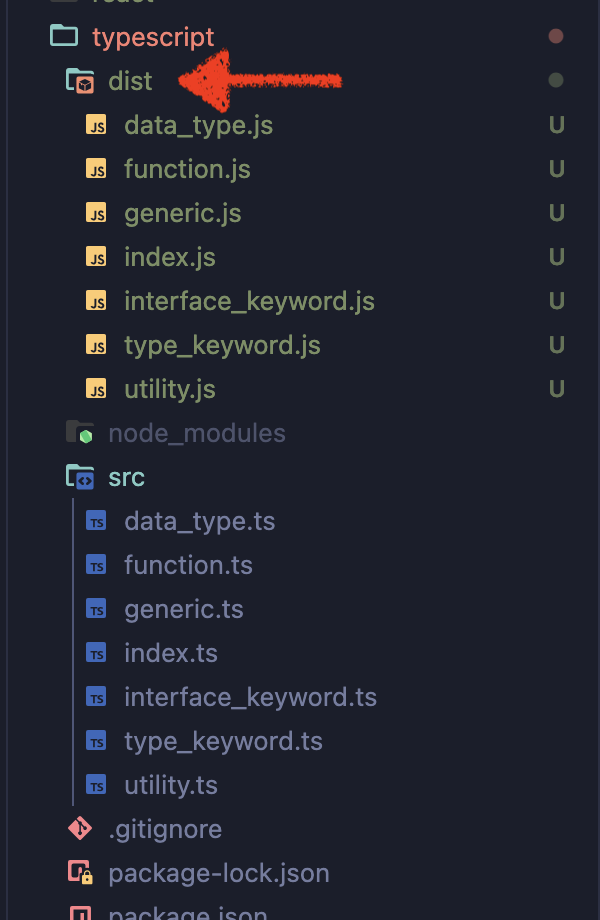

# 타입스크립트

## 학습 키워드

- 타입스크립트
  - 타입스크립트 개발 환경
- 기본 타입
- 타입 추론

<br/>

## 타입스크립트

- 자바스크립트에 타입(type)을 추가한 확장 언어

### ⚙️ 타입스크립트 개발 환경

타입스크립트로 작성된 코드를 실행하려면 타입스크립트 코드를 자바스크립트 코드로 `변환`해주는 작업이 필요하다.
이러한 변환 작업을 `컴파일(compile)`이라고 한다. 컴파일을 하기 위해서 여러가지 방법이 있지만, Node.js를 이용하는 방법으로 학습

#### package.json 생성

```shell
npm init -y
```

#### Typescript 설치

- 개발모드로 설치
  - 컴파일된 자바스크립트 파일만 배포한다.

```shell
npm i -D typescript
```

#### 타입스크립트 초기화 작업 tsconfig.json 생성

> 글로벌으로 설치라는 것보다 개별 프로젝트내 설치해서 사용하는게 훨씬 관리하기 편하다.

```shell
node ./node_modules/typescript/bin/tsc --init
```

#### tsconfig.json 옵션 변경

```json
{
  "compilerOptions": {
    // 컴파일된 JavaScript 코드가 호환될 ECMAScript의 버전을 지정합니다.
    // 여기서는 ECMAScript 2016 (ES7) 버전으로 컴파일됩니다.
    "target": "es2016",

    // 모듈 시스템을 지정합니다. CommonJS 모듈 시스템은 Node.js에서 사용되는 표준입니다.
    // 컴파일된 코드는 CommonJS 모듈 형식을 따릅니다.
    "module": "commonjs",

    // 컴파일된 JavaScript 파일이 출력될 디렉토리를 지정합니다.
    // 여기서는 `./dist` 디렉토리에 컴파일된 파일이 저장됩니다.
    "outDir": "./dist",

    // CommonJS 모듈을 ES6 모듈처럼 사용할 수 있도록 추가적인 코드 변환을 수행합니다.
    // 주로 `import` 구문을 사용할 때 유용합니다.
    "esModuleInterop": true,

    // 파일 이름의 대소문자 일관성을 강제합니다.
    // 파일을 불러올 때 대소문자가 일치하지 않으면 오류를 발생시킵니다.
    // 이는 특히 대소문자를 구분하는 파일 시스템에서 유용합니다.
    "forceConsistentCasingInFileNames": true,

    // 엄격한 타입 검사를 활성화합니다.
    // 여러 가지 타입 검사 옵션을 포함하여 더욱 엄격한 타입 체크를 수행합니다.
    "strict": true,

    // .d.ts 파일의 타입 검사를 건너뜁니다.
    // 이는 컴파일 속도를 높이기 위해 유용합니다.
    "skipLibCheck": true
  },

  // 컴파일 대상 파일을 지정합니다.
  // 여기서는 `src` 디렉토리 아래의 모든 `.ts` 파일을 포함합니다.
  "include": ["src/**/*.ts"],

  // 컴파일에서 제외할 파일을 지정합니다.
  // 여기서는 `node_modules` 디렉토리를 제외합니다.
  "exclude": ["node_modules"]
}
```

#### 타입스크립트 파일 → 자바스크립트로 변환

- `scr`디렉토리 아래의 모든 .ts 파일 → 자바스크립트 파일로 변환
- `tsconfig.json` 옵션 설정인 `outDir` 설정한 폴더 → 변환된 자바스크립트 파일 확인 가능

```shell
npx tsc
```



<br/>

## 타입스크립트의 기본타입

> `:` 를 이용해서 자바스크립트 코드에 타입을 정의하는 방식을 **타입 표기(Type Annotation)** 한다.

### String

```typescript
let str: string = 'Hello World';
```

### Number

```typescript
let num: number = 10;
```

### Boolean

```typescript
let bool: boolean = true;
```

### Null

```typescript
let nullType: null = null;
```

### Undefined

```typescript
let undefinedType: undefined = undefined;
```

### Object

```typescript
let obj: Object = { name: '홍길동' };
let obj2: { name: string } = { name: '홍길동' };
```

### Array

```typescript
let arr1: Array<number> = [1, 2, 3];
let arr2: [] = [];
let arr3: boolean[] = [true, false];
```

### Tuple

- 배열의 길이가 고정되고 각 요소의 타입이 지정되어 있는 배열 형식을 의미

```typescript
let arr: [string, number] = ['문자열', 2];
```

### Any

- 단어 의미 그대로 모든 타입에 대해서 허용한다는 의미

> ✅ 모든 타입이 허용되기 때문에 유연해지지만, 사용은 지양해야 한다.

```typescript
let str: any = '홍길동';
let num: any = 10000;
let arr: any = [2, true, 'string'];
```

### Enum

- 여러개의 값을 나열하는 용도로 사용
- 타입스크립트에서 상수를 다룰 때 사용
  (코드 내에서 의도를 명확하게 표현하거나, 명확히 구분되는 여려 요소를 관리 하기 위해서 사용)
- 컴파일시 객체로 반환

```typescript
// 여러가지 값들에 각각 이름을 부여해 열거해두고 사용하는 타입
enum Role {
  ADMIN, // 0
  USER, // 1
  GUEST, // 2
}
```

### void

- 반환 값이 없는 함수의 반환 타입
- `return`이 없거나 `return`이 있더라도 반환하는 값이 없으면 함수의 반환 타입을 `void`로 지정

```typescript
let voidType: void;

function voidFunc(): void {
  console.log('hi'); // undefined를 반환하는 함수인데 그렇다면 undefined로 지정해두면 되지 않나?
  // return undefined  해당 코드를 기재해주어야 타입검사를 통과하기에 불필요한 코드 사용되므로 해당 타입이 탄생!
}
```

### Never

- 존재하지 않는 , 불가능한 타입

```typescript
function func3(): never {
  while (true) {} // 반복문이 끝날때 까지 반환값이 없는 모순을 가지고 있는 함수의 반환값을 지정시 사용
}

function func4(): never {
  throw new Error(); // 코드 실행 도중 에러를 던지기 때문에 타입을 정의내리기 어려움, 이러한 경우 사용
}

let a: never; // 변수의 타입을 never로 지정해두면 값을 할당할 수 없음. ( undefined, null 까지도 할당 할 수 없음)
```

<br/>

## 타입 추론

- 타입이 정의되어 있지 않은 변수의 타입을 자동으로 추론

> 타입스크립트는 모든 변수에 일일이 타입을 정의하지 않아도 되는 편리함을 제공한다.
> **그러나 모든 상황에 타입을 잘 추론하는 것은 아니다.** 예를 들어 다음과 같이 함수의 매개변수 타입은 자동으로 추론할 수 없다.

```typescript
function func(param: string) {
  // 🚨 타입을 지정하지 않으면 오류로 판단
}
```

### 타입 추론이 가능한 상황

#### 1. 변수 선언

```typescript
let a = 10;
// number 타입으로 추론

let b = 'hello';
// string 타입으로 추론

let c = {
  id: 1,
  name: '이정환',
  profile: {
    nickname: 'winterlood',
  },
  urls: ['https://winterlood.com'],
};
// id, name, profile, urls 프로퍼티가 있는 객체 타입으로 추론
```

#### 2. 구조분해할당

```typescript
let [one, two, three] = [1, 'hello', true];
```

#### 3. 함수의 반환값

- 함수 반환값의 타입은 return 문을 기준으로 추론

```typescript
function func() {
  return 'hello'; // 반환값이 string 타입으로 추론된다
}
```

#### 4. 기본값이 설정된 매개변수

- 기본값이 설정된 매개변수의 타입은 기본값을 기준으로 추론

```typescript
function func(message = 'hello') {
  return 'hello';
}
```

### 타입 추론의 주의 사항

#### 1. const 상수의 추론

- const로 선언된 상수도 타입 추론이 되지만, 그러나 let으로 선언한 변수와는 다른 방식으로 추론된다.

> 📖 리터럴(literal): 소스 코드의 고정된 값을 나타내는 표기법

```typescript
const num = 10;
// 10 Number Literal 타입으로 추론 (즉, 값으로 타입이 지정됨, num은 10이 아니면 에러 발생)

const str = 'hello';
// "hello" String Literal 타입으로 추론
```

#### 2. 암시적으로 any 타입으로 추론

- 변수를 선언할때 초기값을 생략하면 암시적인 any 타입으로 추론

```typescript
let d; // 암시적인 any 타입으로 추론
```

<br/>

## 🔗 참고

- [한입크기로 잘라먹는 타입스크립트](https://ts.winterlood.com/c3003661-2e05-4044-a637-a4c5f1284919)
- [캡틴판교 타입스크립트 핸드북](https://joshua1988.github.io/ts/guide/basic-types.html#any)
