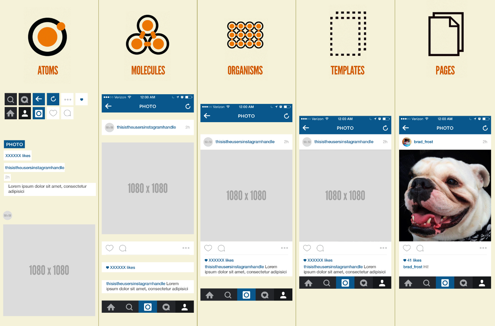

# 4. React Component

## 학습 키워드

- React Component
  - `클래스형 컴포넌트 vs 함수형 컴포넌트`
- Component 계층 구조
  - SRP(단일 책임 원칙)
  - 추출하는 방식 : Extract Function / Inline Function
  - Atomic Design

<br/>

## React Component

### 📖 `Component` 란?

- 작은 단위의 조각, 하나의 블록
- 화면에서 보이는 인터페이스를 설계할 때 `컴포넌트`라는 단위로 설계
- `컴포넌트`는 UI의 일부를 제어하는 `재사용`이 가능하도록 한다.
- 함수형, 클래스형 컴포넌트 존재
- 컴포넌트의 구성요소 : props, state, context

### 클래스(Class) 컴포넌트 vs 함수(Function) 컴포넌트

#### 클래스(Class) 컴포넌트

- 자바스크립트의 `클래스(class)` 기반 컴포넌트
- class로 정의하고 return 문에 JSX 코드를 반환
- React.Component 상속
  - React의 ComponentClass를 상속받아 Component 상속 필수
- render() 메서드 필수 사용
- this 키워드 사용

```jsx
import React, { Component } from 'react'; 

class MyComponent2 extends Component {
    render() {
        return (
            <div>
                Hello React!
            </div>
        );
    }
}
```

#### 함수(Function) 컴포넌트

- 자바스크립트의 `함수(function)` 기반 컴포넌트
- 자바스크립트 함수를 선언하듯이 function으로 컴포넌트를 정의하고 return 문에 JSX 코드를 반환
- 함수 선언, 화살표 함수
- 직관적인 코드, 메모리 자원을 적게 사용

```jsx
function FunctionComponent(){
  return(
    <div>
      hello! React! 
    </div>
  );
}

const FunctionComponent = () => {
  return(
    <div>
      hello! React! 
    </div>
  );
}
```

> __함수형 컴포넌트를 사용 해야 하는 이유__  
과거에는 함수형 컴포넌트가 state, LifeCycle을 지원하지 않았기 때문에 클래스(Class)기반 컴포넌트를 많이 사용했지만, React v16.8 이후 `Hooks`를 통한 state 및 LifeCycle 관리가 가능하므로 공식적으로 __함수형 컴포넌트 사용을__ 권장한다.  

<br/>

### 🔗 참고

- [React 컴포넌트란? React 앱을 구성하는 요소](https://life-with-coding.tistory.com/508)

<br/>

## Component 계층 구조

Component를 어떻게 나눌 것인가? 다양한 방식으로 분리 기준점을 고려 할 수 있다.

### 단일 책임 원칙 (Single Responsibility Principle)

  > __단일 책임 원칙__
  모든 클래스는 하나의 책임만 가지며, 클래스는 그 책임을 완전히 캡슐화해야 한다.

- 하나의 컴포넌트는 한가지 일을 하는게 이상적이다.
- 모든 함수, 컴포넌트 등은 정확히 한가지 작업을 수행 해야하는 책임에 따라 컴포넌트 분리

  - 너무 많은 작업을 수행하는 컴포넌트를 분리
  - 주요 컴포넌트 기능과 관련 없는 함수는 별도의 until로 추출
  - 연결된 기능은 custom hook 등으로 캡슐화

#### 함수 추출 방식 : Extract Function / Inline Function

> 코드 조각을 찾아 무슨 일을 하는지 파악한 다음, 독립된 함수로 추출하고 목적에 맞은 이름을 붙힌다. by 마틴 파울러

- 리팩토링에서 쓸 수 있는 기법
- 함수 추출은 단일 책임 원칙을 위해 쓰이는 방법 중 하나
- [Extract Function](https://refactoring.com/catalog/extractFunction.html)
- [Inline Function](https://refactoring.com/catalog/inlineFunction.html)  

### CSS

- css 클래스 선택자를 고려 할 때의 기준으로 컴포넌트 분리

### Design’s Layer (디자인 측면)

- 디자인 시안의 확인시 레이어를 기준으로 컴포넌트 분리

#### Atomic Design 디자인 시스템

  > 웹디자인과 개발 분야는 지속적으로 복잡성이 증가하고 있다. 디자인과 프론트엔드 개발은 더 이상 간단한 페이지 레이아웃을 넘어서
  __재사용 가능한 컴포넌트와 유지보수가 용이한 시스템을__ 필요로 하게 되었다. 이런한 복잡한 문제에 대응하기 위하여 디자인시스템과 패턴 라이브러리의 필요성이 생겨났다.

- 화학적 관점에서 영감을 얻은 디자인 시스템
- Atoms(원자) -> Molecules(분자) -> Organisms(유기체) -> Templates -> Pages 순으로 작은 것들을 만들고,
   결합해 좀 더 큰 단위의 뷰를 만들어 나가는 디자인 시스템
- __작은 UI 요소부터 시작하여 점차 큰 단위의 UI 구조를 만들어가는 방식을 제안하는 디자인 패턴__ 으로 컴포넌트 분리



### Information Architecture ( 정보 구조도 )

> 웹/엡 구축 시 필요한 화면과 메뉴의 정보 구조를 설계 및 정의하는 문서 <br/> 정보의 구호화를 통해 사용자가 화면을 마주하기까지 필요한 화면들의 흐름을 시각화하여 나타낸다.

- JSON Schema의 영향으로 화면 설계의 기준으로 컴포넌트 분리

<br/>

### 🔗 참고

- [객체 지향 설계 SOLID 원칙 (react의 입장에서)](https://velog.io/@jiwonyyy/객체-지향-설계-SOLID-원칙-react의-입장에서)
- [함수 추출하기 Extract Function](https://velog.io/@phjppo0918/함수-추출하기-Extract-Function)
- [Atomic Design Pattern](https://velog.io/@seul06/AtomicDesignPattern)
- [웹,모바일을 위한 I.A](https://plavement.tistory.com/27)
