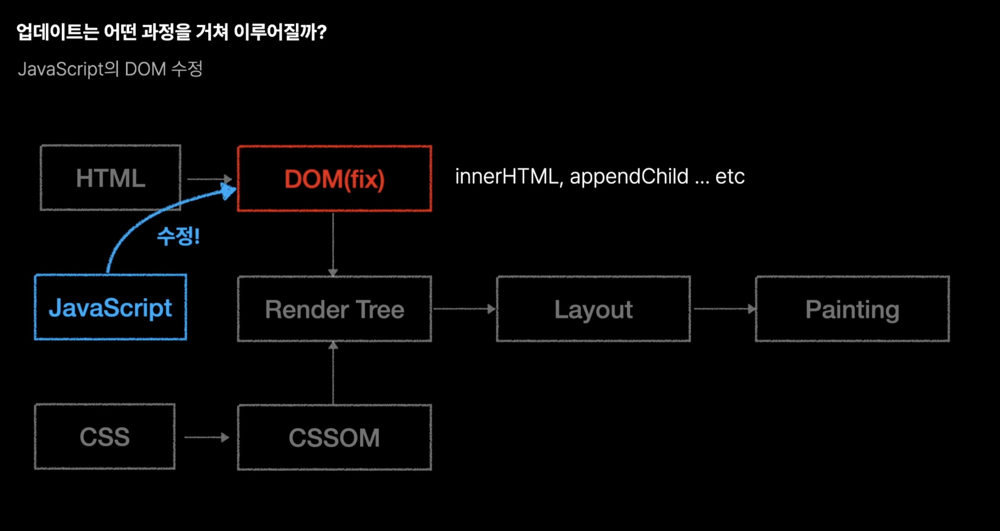
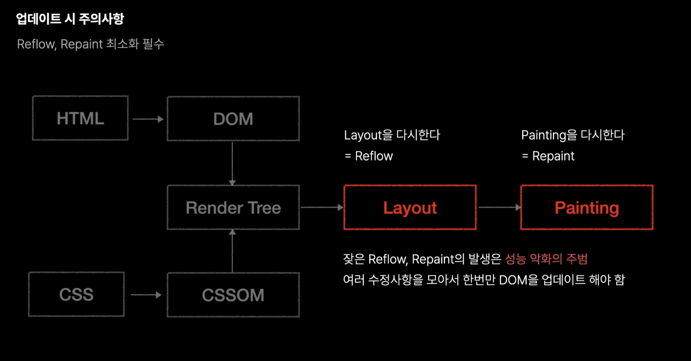
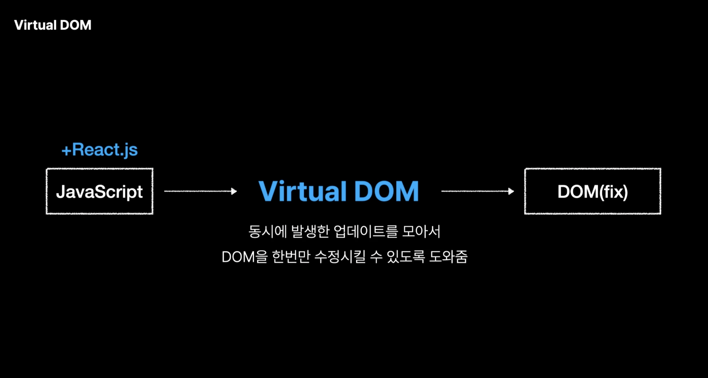

# 3. VirtualDOM

## 학습 키워드

- Virtual Dom 란?
  - 웹 브라우저의 렌더링 과정
    - `파싱`, `렌더링`,`DOM`,`CSSOM`, `Render Tree`, `HTTP/2`, `리렌더링`, `자바스크립트 파싱`,
  - 웹 브라우저가 화면을 업데이트 하는 과정
  - DOM이란?
  - DOM과 Virtual DOM의 차이
- Reconciliation(재조정) 과정은 무엇인가?

 

### 🌎 Virtual DOM의 탄생 배경

#### 1. 웹 브라우저의 렌더링 과정

- __렌더링 엔진__ 이 URI를 통해 요청을 받아 해당하는 데이터를 렌더링 하는 역활을 수행.

- Critical Rendering path
   1. 브라우저는 HTML,CSS, 자바스크립트, 이미지, 폰트 파일 등 렌더링에 필요한 리소스를 요청하고 서버로 부터 응답 받는다.
   2. 브라우저의 렌더링 엔진은 서버로부터 응답된 HTML,CSS를 파싱하여 DOM(Document Object Model)과 CSSOM(CSS Object Model)를 생성하고 이들을 결합하여 Render Tree를 생성한다.
   3. 브라우저의 자바스크립트 엔진은 서버로 부터 응답된 자바스크립트를 파싱하여 AST(Abstract Syntax Tree)를 생성하고 바이트코드로 변환하여 실행한다. 이때 자바스크립트는 DOM API를 통해 DOM이나 CSSOM를 변경 할 수 있다. 변경된 DOM과 CSSOM은 다시 Render Tree로 결합된다.
   4. Render Tree를 기반으로 HTML요소의 레이아웃을 계산하고 브라우저에 화면에 페인팅 한다.

> 3번 과정에 의해서 4번에서 다시 레이아웃을 재계산 하는 상황을 Reflow라고 부른다.

#### 2. 웹 브라우저가 화면을 업데이트 하는 과정

- DOM을 수정할 때마다 Render Tree의 생성부터 Layout(Reflow),Painting(Repaint)의 과정을 다시 수행해야 한다.

- 성능 저하의 주요 원인은 DOM을 수정할 때 발생하는 Reflow, Repaint 과정에 있다. Reflow가 빈번하게 발생하는 경우 브라우저에서는 성능저하가 발생하며, 웹 페이지의 DOM이 복잡하게 구성되어 있고 CSS가 많이 적용된 사이트일수록 더욱 심해진다.

>__Reflow__
레이아웃 계산을 다시 하는 것으로, Reflow가 발생하면 Repaint는 필연적으로 발생
HTML 요소들이 위치와 크기를 다시 계산해야 하기 때문에, 리페인트에 비해서 시간이 오래 걸린다.
즉, 변경하려는 특정 요소의 위치와 크기뿐 아니라, 연관된 다른 요소들의 위치와 크기까지 재계산 해야하기 때문이다.

>__Repaint__
재결합된 Render Tree를 기반으로 다시 화면에 페인트 하는 것을 말한다.

> DOM을 수정하는 일은 수반되는 비용이 크기 때문에, 성능저하를 최소화하기 위해서는 결국 DOM을 최소한으로 수정해야한다. 이러한 문제점을 해결하기 위해 Virtual DOM이 등장하게 되었다.

 

### 📖 Virtual DOM란?

- 실제 DOM의 구조와 비슷한, React 객체의 트리이다.
- 직접 DOM을 수정하지 않고 Virtual DOM을 제어하게 된다.
  - 웹은 점점 더 복잡해져 가는데 수백, 수천개의 DOM을 직접 관리, 조작하는 과정은 복잡하고, 실수가 발생할 가능성도 높아지게 된다.
- Virtual DOM은 이러한 복잡한 과정들을 `자동화`,`추상화`해 준다는 장점이 있다.
- DOM의 update를 Batch 처리로 실제 DOM의 리렌더링 연산을 최소화 할수 있다는 점이다.
  - 즉, 연쇄적으로 Reflow,Repaint가 발생하는 것을 줄이고, 필요한 연산을 한번에 묶어서 처리하게 전달하게 된다.

 

### 🔗 참고

- [웹 브라우저의 렌더링 과정](https://oliviakim.tistory.com/80)
- ⭐️ [브라우저의 렌더링 과정](https://velog.io/@whow1101/38.-%EB%B8%8C%EB%9D%BC%EC%9A%B0%EC%A0%80%EC%9D%98-%EB%A0%8C%EB%8D%94%EB%A7%81-%EA%B3%BC%EC%A0%95)
- [Reflow란](https://velog.io/@heelieben/JavaScript-Reflow-%EB%9E%80-feat.-%EB%B8%8C%EB%9D%BC%EC%9A%B0%EC%A0%80-%EB%A0%8C%EB%8D%94%EB%A7%81)
- [React Virtual DOM](https://velog.io/@1nthek/React-Virtual-DOM%EA%B3%BC-%EB%A0%8C%EB%8D%94%EB%A7%81)
