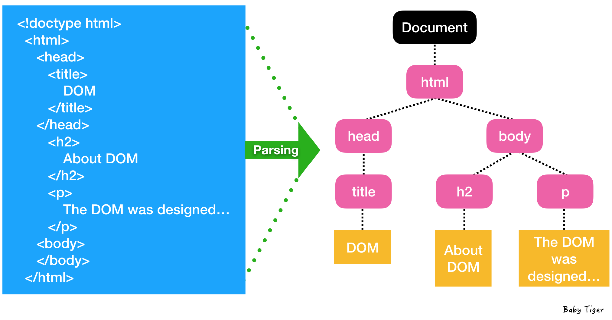
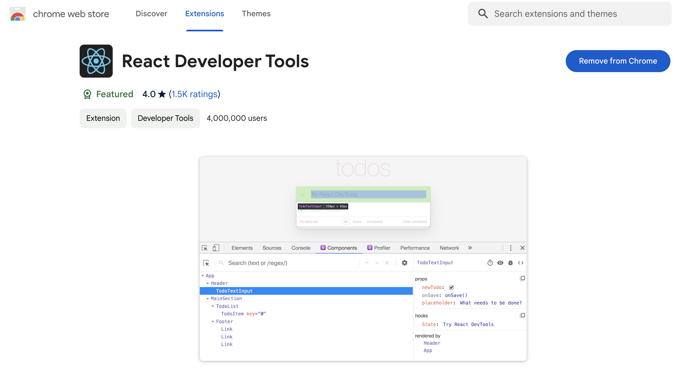

# VirtualDOM

## 학습 키워드

- Virtual Dom 란?
  - DOM이란?
  - 웹 브라우저의 렌더링 과정
    - `파싱`, `렌더링`,`DOM`,`CSSOM`, `Render Tree`, `리렌더링`, `자바스크립트 파싱`,
  - 웹 브라우저가 화면을 업데이트 하는 과정
  - Reconciliation(재조정) 과정은 무엇인가?
- React 성능 최적화 방법
- React Developer Tools
  - React StrictMode

 

## Virtual Dom

### 🌎 Virtual DOM의 탄생 배경

#### 1.DOM이란?

- Document Object Model
- 브라우저는 문자열 형식의 HTML을 곧바로 이해할 수 없기 때문에, 브라우저가 이해하고 활용할 수 있는 구조로의 변환이 필요하다.
DOM(Document Object Model)은 브라우저 렌더링 엔진의 HTML parser에 의해 생성된 __'트리' 구조의 Node 객체 모델__ 이다.

#### 2. 웹 브라우저의 렌더링 과정

- __렌더링 엔진__ 이 URI를 통해 요청을 받아 해당하는 데이터를 렌더링 하는 역활을 수행.

- Critical Rendering path
   1. 브라우저는 HTML,CSS, 자바스크립트, 이미지, 폰트 파일 등 렌더링에 필요한 리소스를 요청하고 서버로 부터 응답 받는다.
   2. 브라우저의 렌더링 엔진은 서버로부터 응답된 HTML,CSS를 파싱하여 DOM(Document Object Model)과 CSSOM(CSS Object Model)를 생성하고 이들을 결합하여 Render Tree를 생성한다.
   3. 브라우저의 자바스크립트 엔진은 서버로 부터 응답된 자바스크립트를 파싱하여 AST(Abstract Syntax Tree)를 생성하고 바이트코드로 변환하여 실행한다. 이때 자바스크립트는 DOM API를 통해 DOM이나 CSSOM를 변경 할 수 있다. 변경된 DOM과 CSSOM은 다시 Render Tree로 결합된다.
   4. Render Tree를 기반으로 HTML요소의 레이아웃을 계산하고 브라우저에 화면에 페인팅 한다.

> 3번 과정에 의해서 4번에서 다시 레이아웃을 재계산 하는 상황을 Reflow라고 부른다.

#### 3. 웹 브라우저가 화면을 업데이트 하는 과정

- DOM을 수정할 때마다 Render Tree의 생성부터 Layout(Reflow),Painting(Repaint)의 과정을 다시 수행해야 한다.

- 성능 저하의 주요 원인은 DOM을 수정할 때 발생하는 Reflow, Repaint 과정에 있다. Reflow가 빈번하게 발생하는 경우 브라우저에서는 성능저하가 발생하며, 웹 페이지의 DOM이 복잡하게 구성되어 있고 CSS가 많이 적용된 사이트일수록 더욱 심해진다.

>__Reflow__
레이아웃 계산을 다시 하는 것으로, Reflow가 발생하면 Repaint는 필연적으로 발생
HTML 요소들이 위치와 크기를 다시 계산해야 하기 때문에, 리페인트에 비해서 시간이 오래 걸린다.
즉, 변경하려는 특정 요소의 위치와 크기뿐 아니라, 연관된 다른 요소들의 위치와 크기까지 재계산 해야하기 때문이다.

>__Repaint__
재결합된 Render Tree를 기반으로 다시 화면에 페인트 하는 것을 말한다.

> 자바스크립트로 DOM조작시 변화된 상태를 반영하기 위해 브라우저는 다시 렌더링하게 된다. 렌더링하는 과정에서 Layout을 재계산하는 과정은 비용이 소요되고 시간 소요가 드는 과정이다. 초기의 웹페이지에서는 DOM을 조작하는 과정이 많지 않았지만 현대 동적인 웹은 사용자와의 교류가 활발하게 일어나기에 DOM을 조작해야하는 상황이 빈번하게 발생하게 된다. 잦은 렌더링으로 Reflow 현생 계속 발생하게 된다면 성능저하의 원인이 되게 된다. 성능저하를 최소화하기 위해서는 결국 DOM을 최소한으로 수정해야 한다. 이러한 문제점을 개선하기 위해 React는 Virtual DOM을 탄생하게 했다.

 

### 📖 Virtual DOM란?

- 실제 DOM의 구조와 비슷한, React 객체의 트리
- Virtual DOM에 변경 내역을 한 번에 모으고(버퍼링) 실제 DOM과 변경된 Virtual DOM의 차이를 판단한 후, 구성요소의 변경이 부분만 찾아 변경하고 그에 따른 렌더링을 한 번만 하는 것으로 렌더링 문제를 개선했다.

#### Reconciliation(재조정)과정은 무엇인가?

> UI의 가상적인 표현을 메모리에 저장하고 React DOM과 같은 라이브러리에 의해 실제 DOM과 동기화하는 프로그래임 개념

Virtual DOM을 사용하면 실제 DOM에 접근하며 조작하는 대신, 이를 __추상화한 자바스크립트 객체를 구성하여__ 사용한다. DOM의 상태를 메모리에 저장하고, 변경 전과 변경 후의 상태를 비교 한뒤 __최소한의 내용만 반영하여 성능 향상을 이끌어낸다.__ DOM의 상태를 메모리 위에 계속 올려두고, DOM에 변경 있을 경우 해당 변경 사항만 반영하는 것이다.

### ✍🏻 VirtualDOM에 대한 정리

- [리액트에 대해서 그 누구도 제대로 설명하기 어려운것 - 왜 Virtual DOM인가](https://velopert.com/3236)
- React의 VirtualDOM은 실제 DOM 렌더링 과정을 최소한으로 연산하게 하여 브라우저의 성능을 향상 해준다.
  - Virtual DOM은 비교(DIFF)를 통해 변경된 부분만 일부분을 실제 DOM에 반영하여 렌더링하게 한다.
- VirtualDOM은 추상화하기 때문에 직관적으로 확인 할 순 없지만, DOM이 변화된 부분을 감지하고 실제 DOM에 동기화 해줌으로서 유지보수가 가능한 어플리케이션을 만드는것을 도와주고 충분히 빠르게 해준다.
- 리액트의 생산성(자동화및추상화)을 극대화 하기 위해선 최적화 하는 작업이 필요하디.

 

### 🔗 참고

- [웹 브라우저의 렌더링 과정](https://oliviakim.tistory.com/80)
- ⭐️ [브라우저의 렌더링 과정](https://velog.io/@whow1101/38.-%EB%B8%8C%EB%9D%BC%EC%9A%B0%EC%A0%80%EC%9D%98-%EB%A0%8C%EB%8D%94%EB%A7%81-%EA%B3%BC%EC%A0%95)
- [Reflow란](https://velog.io/@heelieben/JavaScript-Reflow-%EB%9E%80-feat.-%EB%B8%8C%EB%9D%BC%EC%9A%B0%EC%A0%80-%EB%A0%8C%EB%8D%94%EB%A7%81)
- [DOM과 Virtual Dom이란?](https://www.howdy-mj.me/dom/what-is-dom)
- [React Virtual DOM](https://velog.io/@1nthek/React-Virtual-DOM%EA%B3%BC-%EB%A0%8C%EB%8D%94%EB%A7%81)
- [DOM이란? Virtual DOM을 사용하는 이유?](https://velog.io/@ctdlog/React-DOM%EC%9D%B4%EB%9E%80-Virtual-DOM%EC%9D%84-%EC%82%AC%EC%9A%A9%ED%95%98%EB%8A%94-%EC%9D%B4%EC%9C%A0)
- [Virtual DOM 동작 원리와 이해](https://jeong-pro.tistory.com/210)
- [프로젝트로 배우는 React.js & Next.js 마스터리 클래스](https://www.udemy.com/course/react-next-master/)

 

### 📈 React 성능 최적화

React의 VirtualDOM이 렌더링을 성능을 개선하기 위한 도구이지만, 도구를 잘못 사용하게 된다면 오히려 역효과가 날 수 있다. 또한 애플리케이션의 크기가 커질 수록 성능문제는 발생 된다. 그렇기에 최적화를 하기 위한 전략들이 존재한다.

1. __불필요한 리렌더링 피하기__
    - `shouldComponentUpdate`라이프 사이클 메소드,`React.memo` 사용해서 불필요한 리렌더링 방지

2. __list 렌더링 시 key 속성 사용__
   - key를 사용하면 변경된 항목, 새로운 항목 또는 삭제된 항목을 빠르게 식별 할 수 있다.

3. __컴포넌트의 지연 로딩__
    - 필요하지 않은 컴포넌트가 있는 경우 React.lazy()를 사용하여 지연 로딩 초기로드해야 하는 코드양을 줄어들어 더 빠른 로드 시간을 얻을 수 있다.

4. __배포 시 프로덕션 빌등 사용__
    - 개발용 React 빌드에는 개발 중에 도움이 되는 추가 경고가 포함되어 있지만, 실제로 앱을 사용할 때는 불필요하며 앱 성능을 저하시킴

5. __앱의 성능 프로파일링__
    - React DevTools의 Profiler 탭을 사용하여 앱의 렌더링 "비용"을 측정하고 최적화가 필요한 부분을 식별

#### 🔥 성능 최적화를 위한 전략

- __병목 현상 식별 및 수정__
  - React Developer Tools의 `Profiler` 사용하여 불필요한 리렌더링이나 메모리 누수 등의 병목 현상을 식별한다.
- __메모이제이션__
  - 동일한 props를 가진 함수 컴포넌트의 불필요한 다시 렌더링을 방지하기 위해  `React.memo`를 사용한다.
- __useCallback__
  - 의존성 중 하나가 변경될 때만 변경되는 메모이제이션된 콜백 함수를 반환하기 위해  `useCallback`을 사용한다.
- __useMemo__
  - 의존성 중 하나가 변경될 때만 다시 계산되는 메모이제이션된 값을 반환하기 위해 `useMemo`을 사용한다.
- __지연 로딩과 코드 분할__
  - React.lazy와 Suspense를 사용하여 코드 분할과 지연 로딩을 구현하여 초기 번들 크기를 줄이고 성능을 향상시킵니다.
 

### 🔗 참고

- [React 개발을 위한 모범 사례](https://wikidocs.net/197621)
- [리액트 성능 최적화](https://wikidocs.net/197788)

 

## React Developer Tools

### 🛠️ React Developer Tools

- 확장프로그램을 통해 React 컴포넌트의 구조를 확인 할 수 있는 profiler를 통해 성능 체크를 할 수 있는 도구이다.

### 📖 React StrictMode란 무엇인가?

- [React docs Strict Mode](https://ko.legacy.reactjs.org/docs/strict-mode.html)

> 자바스크립트에서는 엄격 모드가 있다. 코드 파일 상단에 "use strict"를 써 놓으면 자바스크립트를 실행할 때 조금 더 엄격하게 코드를 검사한다. 리액트에도 이와 유사한 목적으로 사용하는  `<StrictMode />`라는 컴포넌트가 있다.

- 애플리케이션 내의 잠재적인 문제를 알아내기 위한 도구
- Fragment와 같이 UI를 렌더링하지 않으며, 자손들에 대한 부가적인 검사와 경고를 활성화한다.
- Strict 모드는 개발 모드에서만 활성화되기 때문에, 프로덕션 빌드에는 영향을 끼치지 않는다.
- StrictMode는 아래와 같은 부분에서 도움이 된다.
  - 안전하지 않은 생명주기를 사용하는 컴포넌트 발견
  - 레거시 문자열 ref 사용에 대한 경고
  - 권장되지 않는 findDOMNode 사용에 대한 경고
  - 예상치 못한 부작용 검사
  - 레거시 context API 검사
  - Ensuring reusable state

> Strict 모드를 사용하면 리액트가 자식 컴포넌트를 검사하고 잘못 사용된 부분을 우리에게 알려준다.   이런 경고 메세지들은 어플리케이션에 잠재된 문제를 해결 할 수 있도록 도와준다.

 

### 🔗 참고

- [리액트 StrictMode](https://jeonghwan-kim.github.io/2022/05/20/react-strict-mode)
