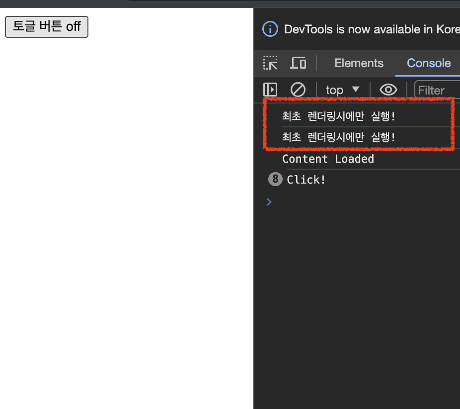

# useEffect

## 학습 키워드

- useEffect
  - Side Effect?
  - Clean-up
  - Effect가 두 번 실행되는 문제
  
<br/>

## 📖 [useEffect](https://react.dev/reference/react/useEffect)란?

[useEffect 공식문서](https://ko.legacy.reactjs.org/docs/hooks-effect.html)

> Effect Hook을 사용하면 함수 컴포넌트에서 side effect를 수행할 수 있습니다.

- __컴포넌트가 렌더링 이후에__ side effect(특정작업)를 수행 할 수 있도록 해주는 기능
- Side-Effect 처리하기 위해 사용하는 hook

### 🤔 Side Effect?

> 함수 내 특정 동작이 함수 외부에 영향을 끼쳐, 프로그램의 동작을 이해하기 어렵게 만드는 행위

- 함수가 실행되면서 함수 외부에 존재하는 값이나 상태를 변경시키는 등의 행위를 의미

예를 들어 함수내에서 전역변수의 값을 변경하거나 혹은 함수 외부에 존재하는 버튼의 텍스트를 변경하거나, 파일을 쓰거나, 쿠키 저장, 네트워크를 통해 데이터를 송신하는 것

#### ✅ Side Effect 를 관리하는 이유

> Side-Effect는 프로그램을 읽기 어렵게 하고, 실행상태를 예측하기 어렵게 하며 개발비용을 증가시킨다고 보기 때문에 최근 선언형 프로그래밍에서는 Side-Effect를 최소화하는 방향으로 변하고 있습니다. 함수는 전달받은 매개변수를 통해 연산을 수행하고 결과를 반환해야 하며 그 결과는 항상 일관되고 예측할 수 있어야 프로그램이 쉽고 단순하며 유지보수 하기 쉬워지기 때문이다.

```jsx
function UserProfile({ name }) {
  const message = `${name}님 환영합니다!`; //함수 반환 값 생성

  // Bad!
  document.title = `${name}의 개인정보`; //함수 외부와 상호작용하는 Side-effect 코드
  return <div>{message}</div>;
}
```

해당 코드에서 함수형 컴포넌트가 실행되고 결과를 생성하는 것과 무관한 `document.title`을 수정하고 있다. 함수 외부와 상호작용하는 Side effect 코드는 useEffect를 사용해서 분리해줘야 한다.

```jsx
function UserProfile({ name }) {
  const message = `${name}님 환영합니다!`; 
   
   useEffect(()=> {
      document.title = `${name}의 개인정보`; 
   },[name]);
 
  return <div>{message}</div>;
}
```

### ✍🏻 useEffect 정리

- useEffect는 컴포넌트가 최대한 순수 함수가 될 수 있도록 Side Effect를 따로 관리 할 수 있도록 한다.
- 매번 컴포넌트가 렌더링 될 때 특정 조건에 의존하여 수행되며, 컴포넌트가 최대한 순수 함수를 유지할 수 있도록 도와주는 함수

<br/>

## 🤖 useState 사용법

```jsx
import { useEffect } from "react"; // 사용을 위해 import 해줘야 하고,

useEffece(()=> {}, [dependency Array]) // 콜백함수와 의존성배열을 인자로 넣어준다.
```

useEffect는 함수의 인자(의존성배열)정보에 따라 크게 세가지 방식으로 동작한다.

### 무한반복

컴포넌트가 렌더링 될 때 마다 useEffect의 인자로 전달한 콜백함수가 실행된다.

```jsx
import { useEffect, useState } from 'react';

export default function TimerControl() {
  const [playing, setPlaying] = useState(false);

  useEffect(() => {
    console.log('매번 실행');
  });

  const handleClick = () => {
    console.log('Click!');
    setPlaying(!playing);
  };

  return (
    <div>
      <button type="button" onClick={handleClick}>
        토글 버튼 {playing ? `on` : `off`}
      </button>
    </div>
  );
}
```

### 처음에 한번만 실행하기

이전 예제와 동일하지만, useEffect 부분에 두번째 인자가 생겼다. 두번째 인자를 빈 배열로 전달하게 되면, __컴포넌트가 최초 렌더링될 때만 useEffect를 실행한다.__

⇒ useEffect 컴포넌트가 렌더링 된 후 매번 콜백함수를 실행한다. 그러나 의존성 배열의 값이 빈 배열로 전달되게 되면 변경되는 값이 없기 때문에 최초 렌더링 될 때만 실행되는 것이다.

```jsx
import { useEffect, useState } from 'react';

export default function TimerControl() {
  const [playing, setPlaying] = useState(false);

  useEffect(() => {
    console.log('최초 렌더링시에만 실행!');
  },[]);

  const handleClick = () => {
    console.log('Click!');
    setPlaying(!playing);
  };

  return (
    <div>
      <button type="button" onClick={handleClick}>
        토글 버튼 {playing ? `on` : `off`}
      </button>
    </div>
  );
}
```

### 의존성 배열 사용

```jsx
import { useEffect, useState } from 'react';

export default function TimerControl() {
  const [playing, setPlaying] = useState(false);
  const [count, setCount] = useState(0);

  useEffect(() => {
    console.log('playing값이 변경되면 실행!');
  }, [playing]);

  const handleToggleClick = () => {
    console.log('Toggle Click!');
    setPlaying(!playing);
  };

  const handleAddClick = () => {
    console.log('Add Click!');
    setCount(count+1);
  };

  return (
    <div>
      <button type="button" onClick={handleToggleClick}>
        토글 버튼 {playing ? `on` : `off`}
      </button>
      <p>{count}</p>
       <button type="button" onClick={handleAddClick}>
        증가 버튼 
      </button>
    </div>
  );
}
```

위의 코드는 의존성배열에 `playing` state 값을 인자로 전달하였다.
`playing`의 상태값이 변경 될 때 마다 useEffect의 콜백함수가 실행되는 걸 알 수 있다.

### 정리(clean-up)를 이용하는 Effects

> 정리(clean-up)가 필요한 Side effect도 있다. 외부 데이터에 구독(subscription)을 설정해야 하는 경우,이런 경우에 메모리 누수가 발생하지 않도록 정리(clean-up)하는 것은 매우 중요합니다.

- 메모리 누수가 발생되지 않도록 등록한 이벤트를 제거해주는 함수가 필요한 경우

```jsx
import { useEffect, useState } from 'react';

export default function TimerControl() {
  const [count, setCount] = useState(1000);

  useEffect(() => {
    console.log('useEffect 실행');
    return () => {
      console.log('return 문의 함수 === cleanup');
    };

  }, [count]);

  const countHander = (e) => {
    setCount((c) => c + 1000);
  };

  return (
    <div className="App">
      <h1>{count}</h1>
      <button onClick={countHander}>카운트 증가</button>
    </div>
  );
}
```

위의 코드를 보면 useEffect 함수에 return문이 추가되었다. return문의 첫 렌더링 시점에는
return문의 함수는 실행되지 않는다. 카운트 증가 버튼을 클릭하면 useEffect가 다시 호출되기 전에 useEffect의 return에 작성한 콜백이 실행된다.

#### ⇒ useEffect의 return으로 반환되는 함수는

- 의존성 배열의 값이 빈배열 경우 : 컴포넌트가 최종적으로 DOM에서 unmount되는 시점에만 수행
- 의존성 배열의 값이 있는 경우 : 값의 변경이 감지될 때마다 useEffect가 재수행될 것이기 때문에 return뭄 함수 또한 계속 실행

<br/>

### ✍🏻 useEffect 사용법 정리

```jsx
useEffect(() => {
  // 매 렌더링마다 실행
});

useEffect(() => {
  // 컴포넌트가 처음 렌더링된 실행
}, []);

useEffect(() => {
  // 컴포넌트가 처음 렌더링된 이후 실행
  // a나 b가 변경되어 컴포넌트가 재렌더링된 이후 실행
}, [a, b]);

useEffect(() => {
  return () => {
    // 컴포넌트가 사라지는 시점 
  }
}, []);

useEffect(() => {
  // 2. return 문의 함수가 실행 된 후 실행 
  return () => {
    // 1. a나 b가 변경되어 업데이트가 되기 전에 먼저 실행
  }
}, [a, b]);
```

### Effect가 두 번 실행되는 문제

<React.StrictMode>로 컴포넌트 전체를 감쌀 경우,
예상치 못한 Side Effect를 찾으려고 Effect 등을 두 번씩 실행함

```jsx
ReactDOM.createRoot(document.getElementById('root')!).render(
  <React.StrictMode>
    <App />
  </React.StrictMode>
);
```



<br/>

### 🔗 참고

- [useEffect 완벽 가이드](https://overreacted.io/a-complete-guide-to-useeffect/)
- [useEffect()와 Side-Effect](https://points.tistory.com/86)
- [그래서 useEffect는 언제 쓰는건데요?](https://velog.io/@sucream/그래서-useEffect는-언제-쓰는건데요)
- [useEffect 실행시점 짚고 가기](https://choyeon-dev.tistory.com/10)
