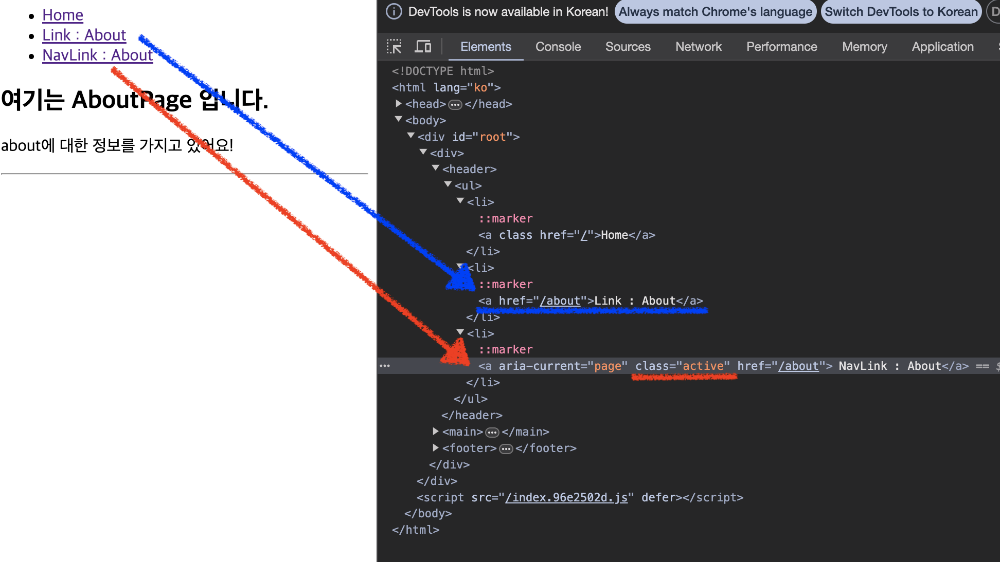

# Navigation

## 학습 키워드

- History
  - History.pushState
- Link
- NavLink
- Navigate
- useNavigate

<br/>

## History

> [History](https://developer.mozilla.org/ko/docs/Web/API/History) 인터페이스는 브라우저의 세션 기록, 즉 현재 페이지를 불러온 탭 또는 프레임의 방문 기록을 조작할 수 있는 방법을 제공합니다.

### [History.pushState](https://developer.mozilla.org/ko/docs/Web/API/History/pushState)

> HTML 문서에서, history.pushState() 메서드는 브라우저의 세션 기록 스택에 항목을 추가합니다.

```js
const state = {}; // 브라우저 이동 시 넘겨줄 데이터 (popstate 에서 받아서 원하는 처리를 해줄 수 있음)
const title = ''; // 변경할 브라우저 제목 (변경 원치 않으면 null)
const url = '/경로'; // 변경할 주소

history.pushState(state, title, url);
```

React 에서 페이지 전환할때 사용하는 react-router 는 history.push 를 통해 마치 SSR 처럼 브라우저 주소를 바꿔주고
동시에 Root 엘리먼트의 내용물도 바꿔준다. 이걸 순수 JS 로 구현하고자 한다면 history.pushState 를 사용하면 된다.

__History.pushState 는 페이지 이동 없이 주소만 바꿔준다.__ (브라우저의 뒤로가가 버튼이 활성화 된다.)
브라우저 페이지를 이동하게 되면 window.onpopstate 라는 이벤트가 발생하게 되는데, pushState 를 했을때는 popstate 이벤트가 발생하지않고, `뒤 / 앞으로 가기`를 클릭 했을때 popstate 이벤트가 발생하게 된다.
즉, pushState 와 popstate 둘을 이용하여 SPA 의 페이지 전환을 구현할 수 있다.

<br/>

### 🤔 React에서는 `<a>` 태그를 사용하지 않는다?

> 왜냐면 `<a>`를 사용하여 페이지 이동하게 되며 페이지 __전체를__ 다시 렌더링 하기 때문이다.

그래서 React Router 는 `Link` __특정 주소로 이동해주는 기능을__ , `Navigation` 특정 행동을 했을 때 해당 주소로 이동 할 수 있는 기능을 제공해준다.

<br/>

## [Link](https://reactrouter.com/en/main/components/link)

```jsx
<Link to="/경로"> ..... </Link>
```

```jsx
import { Link } from 'react-router-dom';

export default function Header() {
  return (
    <header>
      <ul>
        <li>
          <Link to="/">Home</Link>
        </li>
        <li>
          <Link to="/about">About</Link>
        </li>
      </ul>
    </header>
  );
}
```

<br/>

## [NavLink](https://reactrouter.com/en/main/components/nav-link#default-active-class)

```jsx
<NavLink to="/경로"> ..... </NavLink>
```

```jsx
import { Link, NavLink } from 'react-router-dom';

export default function Header() {
  return (
    <header>
      <ul>
        <li>
          <NavLink to="/">Home</NavLink>
        </li>
        <li>
          <NavLink to="/about">About</NavLink>
        </li>
      </ul>
    </header>
  );
}
```

<br/>

### 🤔 NavLink는 `Link` 무엇이 다른가?

> By default, an active class is added to a `<NavLink>` component when it is active so you can use CSS to style it.

> It provides useful context for assistive technology like screen readers

활성화된 페이지에 기본적으로 `active` class를 제공해준다.
`aria-current` 또한 지원해준다.



<br/>

## [Navigate](https://reactrouter.com/en/main/components/navigate)

- 어떤 작업을 수행하고 리다이렉션을 발생시킬 때 사용 (Ex.Logout)

> 📖 Redirect <br/> 사용자가 처음 요청한 URL이 아닌, 다른 URL로 보내는 것을 의미한다. 예를들어, 웺사이트 A의 주소로 접속한 사용자를 웹사이트 B로 이동시키는 것을 말한다.

```jsx
<Navigate to="/경로" />
```

```jsx
// LogoutPage.tsx

import { Navigate } from 'react-router-dom';

export default function LogoutPage() {
  return <Navigate to="/" />;
}
```

### 🚨 Redirect을 하는 LogoutPage 테스트 결과 Error 발생

```jsx
// routes.test.tsx

context('when the current path is “/logout”', () => {
  it('redirects to the home page', () => {
    renderRouter('/logout');

    screen.getByText(/환영/);
  });
});
```

> `ReferenceError: Request is not defined` MSW 배울 때 사용했던 폴리필 whatwg-fetch import 해서 사용하자. → 정확한 이유는... 아직 이해되지 않았다. 특수한 상황이라고 한다.

<br/>

## [useNavigate](https://reactrouter.com/en/main/hooks/use-navigate)

- 어떤 작업을 수행하고 리다이렉션을 발생시킬 때 사용 (Ex.Logout)
- Hook을 이용해 redirect을 편리하게 처리

```jsx
const navigate = useNavigate();

navigate('/');
```

### useNavigate 의 인자

```jsx
const navigate = useNavigate();

navigate('경로', {replace, state });
```

#### 📌 replace

```jsx
const navigate = useNavigate();

navigate('경로', {replace : true });
```

- `true` : navigate에 적힌 주소로 이동한 후 `뒤로가기`를 방지하는 옵션
- `false` :  navigate에 적힌 주소로 이동한 후 `뒤로가기`를 가능하게 하는 옵션 (Default)

#### 📌 state

```jsx
const navigate = useNavigate();

navigate('경로', {state : {....props} });
```

- navigate에 적힌 주소로 이동한 후 state 전달 해 줄 수 있다.
- 전달 받은 state는 `useLocation` Hook을 이용해 사용 할 수 있다.

<br/>

## 🔗 참고

- [history.pushState ( 화면 전환 )](https://kwangsunny.tistory.com/28)
- [리다이렉트(Redirect)](https://docs.tosspayments.com/resources/glossary/redirect)
- [react 에서 navigate 사용하기 (useNavigate / Navigate)](https://carmack-kim.tistory.com/127)
- [useNavigate로 state 넘기기](https://velog.io/@gin2808/React-useNavigate로-state-넘기기)
