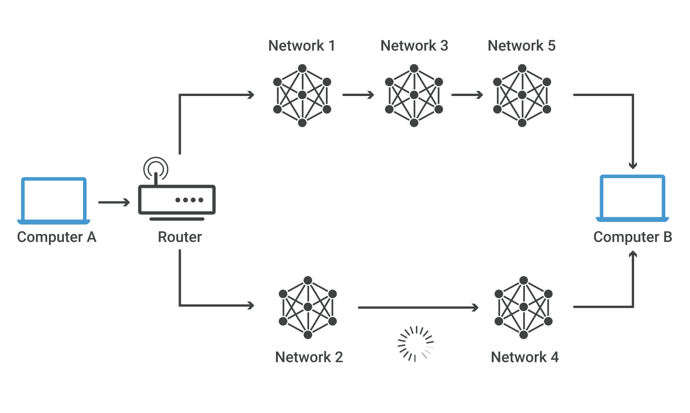
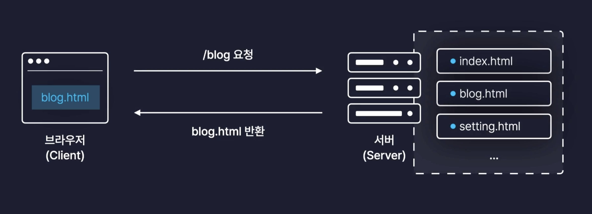
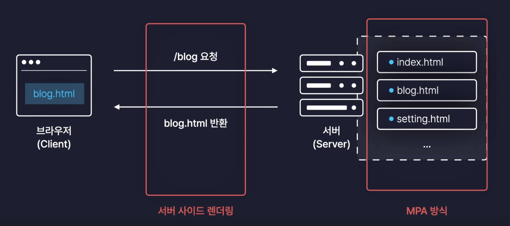
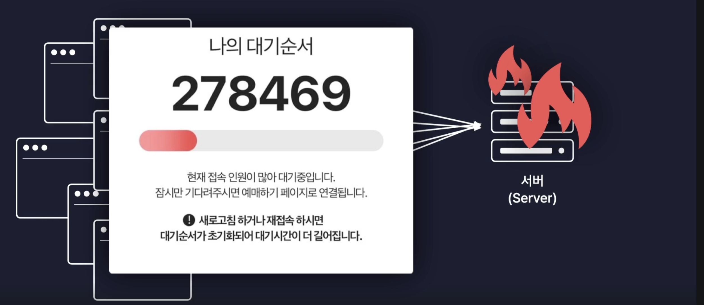
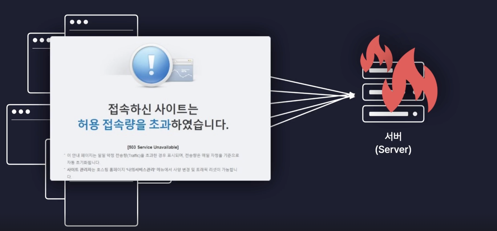

# Routing

## 학습 키워드

- HTML DOM API
  - Location
  - pathname
  - hash
- Routing
  - MPA
  - SPA
  - SSR
  - CSR

<br/>

## [HTML DOM API](https://developer.mozilla.org/ko/docs/Web/API/HTML_DOM_API)

> HTML의 각 elements의 기능을 정의하는 인터페이스와 해당 요소가 의존하는 모든 지원 유형 및 인터페이스로 구성됩니다.

#### HTML DOM API에 포함 된 기능

- DOM을 통한 HTML 요소에 대한 접근 및 제어.
- 양식 데이터에 대한 접근 및 조작.
- 2D 이미지의 콘텐츠 및 HTML `canvas`의 맥락과 해당 요소 위에 그리는 것과 같은 상호 작용.
- HTML 미디어 요소 (`audio`및 `video`)에 연결된 미디어 관리.
- 웹 페이지에서 콘텐츠 드래그 앤 드롭.
- 브라우저 탐색 기록에 대한 접근
  - Web Components, Web Storage, Web Workers, WebSocket 및 Server-sent events와 같은 기타 API에 대한 연결 인터페이스 지원.

### [Location](https://developer.mozilla.org/ko/docs/Web/API/Location)

> Location 인터페이스는 객체가 연결된 장소(URL)를 표현합니다. Location 인터페이스에 변경을 가하면 연결된 객체에도 반영되는데, Document와 Window 인터페이스가 이런 Location을 가지고 있습니다. 각각 Document.location과 Window.location으로 접근할 수 있습니다.

- Location은 즉 URL의 정보를 담고 있다는걸 의미

#### 🤔 [Window.location](https://developer.mozilla.org/ko/docs/Web/API/Window/location)은 그럼 무엇일까?

> 읽기 전용 속성으로, 문서의 현재 위치에 대한 정보가 담긴 Location 객체를 반환합니다.

- 브라우저내에서 현재 페이지의 위치 URL의 정보에 대해 알 수 있는 속성

<br/>

### [PathName](https://developer.mozilla.org/ko/docs/Web/API/URL/pathname)

> URL 인터페이스의 pathname 속성은 URL의 경로와 그 앞의 `/`로 이루어진 USVString을 반환한다.

- URL의 구성요소 path를 의미


```javascript
var url = new URL(
  "https://developer.mozilla.org/ko/docs/Web/API/URL/pathname?q=value",
);
var result = url.pathname; // "/ko/docs/Web/API/URL/pathname"
```

<br/>

### [hash](https://developer.mozilla.org/en-US/docs/Web/API/Location/hash)

> The hash property of the Location interface returns a string containing a '#' followed by the fragment identifier of the URL — the ID on the page that the URL is trying to target.

- URL 내의 `#` 뒤에 나오는 식별자를 value로 하는 DOMstring

#### hash의 쓰임새

- #id를 활용해 클릭 할 때 지정한 Anchor로 이동  
- <https://developer.mozilla.org/ko/docs/Web/API/Location#예제>

```
encodeURI('예제')

'#%EC%98%88%EC%A0%9C'
```

```
decodeURI(location.hash)

'#예제'
```

<br/>

## [Routing](https://ko.wikipedia.org/wiki/%EB%9D%BC%EC%9A%B0%ED%8C%85)

> 어떤 네트워크 안에서 통신 데이터를 보낼 때 최적의 경로를 선택하는 과정이다.

- 라우터가 수신한 패킷을 최적의 경로로 전달하기 위한 과정
- 데이터를 목적지까지 전달하기 위한 모든 일련의 과정



### ✍🏻 Web에서 말하는 Routing(라우팅)이란?

- 웹 사이트는 URL에 따라 다른 웹 페이지를 보여준다. 이와 같은 과정을 `Routing` 이라고 한다.
- (URL)경로에 따라 알맞은 페이지를 렌더링 하는 과정 → `Page Routing`

사용자가 브라우저 URL을 입력하게 되면 서버에게 페이지에 대한 정보를 요청하고 서버로 응답은 페이지 정보를 브라우저 화면에 보여주는 과정을 __페이지라우팅__ 이라고 한다.

<br/>

### 🤔 React에서 Routing 처리를 배워하는 이유는 무엇일까?

#### 🌐 전통적인 Web의 문제점

전통적인 Web 서비스들은 웹서버가 사용자들에 제공되어야 하는 모든 페이지들의 정보를 미리 가지고 있는 `MPA(Multi Page Application)` 방식이었다.



> ✅ SSR(Server Side Rendering) 과 MPA(Multi Page Application)는 같다? <br/> 서버에 모든 페이지들의 정보를 가지고 있는 걸 MPA 방식이라고 하고, __MPA방식에서 브라우저가 페이지를 요청 했을 때 서버에서 모든 데이터가 담긴 HTML 파일을 브라우저에게 응답해주는 방식을__ SSR이라고 한다.



그런데, 모바일 디바이스 사용이 늘어나면서, __MPA 방식의 단점이__ 부각되었다.<br/>

#### 🚨 단점 1

MPA 방식으로 특정 페이지를 요청하게 되면 기존의 페이지는 제거하고 응답은 페이지를 전체를 새롭게 화면에 렌더링 하게 되면서 새로고침 되는 것 처럼 화면이 깜빡이게 된다. 페이지에 공통으로 사용되는 동일한 요소가 있더라도 다시 그려내기 때문에 비효율이고 사용자 입장에서는 매끄럽지 못한 페이지 이동을 경험하게 된다.

#### 🚨 단점 2

또한 동시에 많은 사용자가 페이지에 접속 할 경우 서버는 모든 요청에 대한 응답을 처리해야 하기 때문에 부하가 매우 심해지게 된다. 부하로 인해 화면에 로딩이 발생하게 되고, 서버가 터져 버리는 경우가 있다.




#### 🌎 SPA가 Web 앱의 시대를 열다

> 그렇다면 매번 서버와 요청을 주고받지 말고, 처음에 모두 다운받아 보여주면 어떨까?

이 방식이 바로, react.js 같은 SPA(Single Page Application)이다.

`SPA(Single Page Application)`방식은 접속 요청이 들어오게 되면 먼저 기본틀인 하나의 HTML 보내주고 자바스크립트의 파일들을 하나로 묶어서 번들링 해서
브라우저에 후속으로 전달해준다. 브라우저는 후속으로 전달 받은 React App(번들링 된 자바스크립트 파일들)을 실행해서 화면을 보여주는 방식을 말한다.

SPA방식에서는 사용자가 링크나 버튼을 클릭해서 페이지 이동이 발생하게 된다면 새로운 페이지를 매번 서버에게 요청했었던 MPA 방식과는 달리 서버에게는 아무런 요청도 보내지 않는다.
대신에 처음 접속할 때 서버로부터 받았던 React App을 이용해서 자체적으로 브라우저 내에서 새로운 페이지에 필요한 컴포넌트들로 화면을 교체한다.

### 라우팅 구현하기

React에서는 하나의 웹 페이지를 하나의 컴포넌트로 만들고, URL에 따라 적절한 컴포넌트가 보이게 함으로써 Routing을 구현한다.

#### Example 1

```jsx
import Header from './components/Header';
import Footer from './components/Footer';

import HomePage from './pages/HomePage';
import AboutPage from './pages/AboutPage';

function App() {
 const { pathname } = window.location; // url에서 pathname 추출 하는 속성
 
 return (
  <div>
   <Header />
   <main>
    {pathname === '/' && <HomePage />} 
    {pathname === '/about' && <AboutPage />}
   </main>
   <Footer />
  </div>
 );
}
```

#### Example 2

```jsx
import Header from './components/Header';
import Footer from './components/Footer';

import HomePage from './pages/HomePage';
import AboutPage from './pages/AboutPage';

const pages = {
  '/': HomePage,
  '/about': AboutPage,
};

export default function App() {
  const path = window.location.pathname;

  const Page = Reflect.get(pages, path) || HomePage;

  return (
    <div>
      <Header />
      <main>
        <Page />
      </main>
      <Footer />
    </div>
  );
}
```

<br/>

## 🔗 참고

- [Location.hash 로 URL을 사용하는 목적](https://webroadcast.tistory.com/1)
- [라우팅이란? 무엇인가?](https://dentuniverse.tistory.com/entry/%EB%84%A4%ED%8A%B8%EC%9B%8C%ED%81%AC-%EB%9D%BC%EC%9A%B0%ED%8C%85%EC%9D%B4%EB%9E%80-%EB%AC%B4%EC%97%87%EC%9D%B8%EA%B0%80-%EC%9A%B0%EC%A3%BC%EB%A5%BC%EB%86%80%EB%9D%BC%EA%B2%8C%ED%95%98%EC%9E%90)
- [라우팅이란?](https://annajin.tistory.com/71)
- [Routing](https://shinjungohs-dev-road.gitbook.io/megaptera-frontend/undefined/week7/routing#id-1.-routing)
- [https://velog.io/@heebeom/React-Routing의-중요성](https://velog.io/@heebeom/React-Routing%EC%9D%98-%EC%A4%91%EC%9A%94%EC%84%B1)
- [한입 크기로 잘라 먹는 리액트(React.js) : 기초부터 실전까지](https://inf.run/N9fZn)
