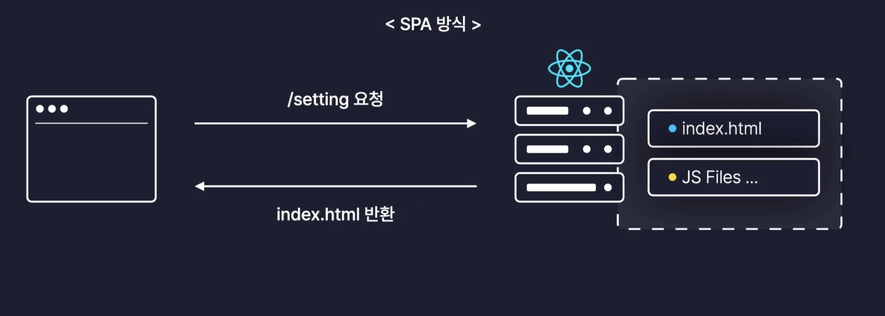

# Routing

## 학습 키워드

- HTML DOM API
  - Location
  - pathname
  - hash
- Routing
  - MPA
  - SPA
  - SSR
  - CSR

<br/>

## [HTML DOM API](https://developer.mozilla.org/ko/docs/Web/API/HTML_DOM_API)

> HTML의 각 elements의 기능을 정의하는 인터페이스와 해당 요소가 의존하는 모든 지원 유형 및 인터페이스로 구성됩니다.

#### HTML DOM API에 포함 된 기능

- DOM을 통한 HTML 요소에 대한 접근 및 제어.
- 양식 데이터에 대한 접근 및 조작.
- 2D 이미지의 콘텐츠 및 HTML `canvas`의 맥락과 해당 요소 위에 그리는 것과 같은 상호 작용.
- HTML 미디어 요소 (`audio`및 `video`)에 연결된 미디어 관리.
- 웹 페이지에서 콘텐츠 드래그 앤 드롭.
- 브라우저 탐색 기록에 대한 접근
  - Web Components, Web Storage, Web Workers, WebSocket 및 Server-sent events와 같은 기타 API에 대한 연결 인터페이스 지원.

### [Location](https://developer.mozilla.org/ko/docs/Web/API/Location)

> Location 인터페이스는 객체가 연결된 장소(URL)를 표현합니다. Location 인터페이스에 변경을 가하면 연결된 객체에도 반영되는데, Document와 Window 인터페이스가 이런 Location을 가지고 있습니다. 각각 Document.location과 Window.location으로 접근할 수 있습니다.

- Location은 즉 URL의 정보를 담고 있다는걸 의미

#### 🤔 [Window.location](https://developer.mozilla.org/ko/docs/Web/API/Window/location)은 그럼 무엇일까?

> 읽기 전용 속성으로, 문서의 현재 위치에 대한 정보가 담긴 Location 객체를 반환합니다.

- 브라우저내에서 현재 페이지의 위치 URL의 정보에 대해 알 수 있는 속성

<br/>

### [PathName](https://developer.mozilla.org/ko/docs/Web/API/URL/pathname)

> URL 인터페이스의 pathname 속성은 URL의 경로와 그 앞의 `/`로 이루어진 USVString을 반환한다.

- URL의 구성요소 path를 의미


```javascript
var url = new URL(
  "https://developer.mozilla.org/ko/docs/Web/API/URL/pathname?q=value",
);
var result = url.pathname; // "/ko/docs/Web/API/URL/pathname"
```

<br/>

### [hash](https://developer.mozilla.org/en-US/docs/Web/API/Location/hash)

> The hash property of the Location interface returns a string containing a '#' followed by the fragment identifier of the URL — the ID on the page that the URL is trying to target.

- URL 내의 `#` 뒤에 나오는 식별자를 value로 하는 DOMstring

#### hash의 쓰임새

- #id를 활용해 클릭 할 때 지정한 Anchor로 이동  
- <https://developer.mozilla.org/ko/docs/Web/API/Location#예제>

```
encodeURI('예제')

'#%EC%98%88%EC%A0%9C'
```

```
decodeURI(location.hash)

'#예제'
```

<br/>

## [Routing](https://ko.wikipedia.org/wiki/%EB%9D%BC%EC%9A%B0%ED%8C%85)

> 어떤 네트워크 안에서 통신 데이터를 보낼 때 최적의 경로를 선택하는 과정이다.

- 라우터가 수신한 패킷을 최적의 경로로 전달하기 위한 과정
- 데이터를 목적지까지 전달하기 위한 모든 일련의 과정


### ✍🏻 Web에서 말하는 Routing(라우팅)이란?

- 웹 사이트는 URL에 따라 다른 웹 페이지를 보여준다. 이와 같은 과정을 `Routing` 이라고 한다.
- (URL)경로에 따라 알맞은 페이지를 렌더링 하는 과정 → `Page Routing`

> Page Routing? <br/> 사용자가 브라우저 URL을 입력하게 되면 서버에게 페이지에 대한 정보를 요청하고 서버로 응답은 페이지 정보를 브라우저 화면에 보여주는 과정을 __페이지라우팅__ 이라고 한다.

<br/>

### 🤔 React에서 Routing 처리를 배워하는 이유는 무엇일까?

#### 🌐 전통적인 Web의 문제점

전통적인 Web 서비스들은 사용자가 다른 페이지로 이동할 때마다 새로운 html을 받아오고, 페이지를 로딩할 때마다 서버에서 CSS, JS, 이미지 파일 등의 리소스를 전달받아 브라우저 화면에 보여주는 `MPA(Multi Page Application)`방식이었다.


> ✅ SSR(Server Side Rendering) 과 MPA(Multi Page Application)는 같다? <br/> MPA는 서버로부터 새로운 HTML을 새로 받아와서 페이지 전체를 렌더링 하는 전통적인 웹 페이지 구성 방식을 말하고 __MPA방식에서 서버에서 이미 렌더링 된 정적 리소스를 받아오는 방식을__ SSR이라고 한다.


그런데, 모바일 디바이스 사용이 늘어나면서, __MPA 방식의 단점이__ 부각되었다.<br/>

#### 🚨 단점 1

MPA 방식으로 특정 페이지를 요청하게 되면 기존의 페이지는 제거하고 응답은 페이지를 전체를 새롭게 화면에 렌더링 하게 되면서 새로고침 되는 것 처럼 화면이 깜빡이게 된다. 페이지에 공통으로 사용되는 동일한 요소가 있더라도 다시 그려내기 때문에 비효율이고 사용자 입장에서는 매끄럽지 못한 페이지 이동을 경험하게 된다.

#### 🚨 단점 2

또한 동시에 많은 사용자가 페이지에 접속 할 경우 서버는 모든 요청에 대한 응답을 처리해야 하기 때문에 부하가 매우 심해지게 된다. 부하로 인해 화면에 로딩이 발생하게 되고, 서버가 터져 버리는 경우가 있다.


#### 🌎 SPA가 Web 앱의 시대를 열다

> 그렇다면 매번 서버와 요청을 주고받지 말고, 처음에 모두 다운받아 보여주면 어떨까?

이 방식이 바로, React.js 같은 SPA(Single Page Application)이다.

`SPA(Single Page Application)`방식은 최초 요청이 들어오게 되면 먼저 기본틀인 하나의 HTML 보내주고 자바스크립트의 파일들을 하나로 묶어서 번들링 한 후 브라우저에게 후속으로 전달해준다. 브라우저는 후속으로 전달 받은 번들링 된 자바스크립트 파일들을 실행해서 화면을 보여준다.




SPA방식에서는 사용자가 링크나 버튼을 클릭해서 페이지 이동이 발생하게 된다면 새로운 페이지를 매번 서버에게 요청했었던 MPA 방식과는 달리 서버에게는 아무런 요청도 보내지 않는다.
대신에 처음 접속할 때 서버로부터 받았던 React App을 이용해서 자체적으로 브라우저 내에서 새로운 페이지에 필요한 컴포넌트들로 화면을 교체한다.

#### ✍🏻 정리

React는 SPA(Single Page Application) 단일 페이지 애플리케이션의 기술을 사용한다. 페이지 전체를 새로고침하는 것이 아닌 페이지 뷰를 단일 페이지에서 동적으로 그리게 된다.
다른 주소에 따라 다른 뷰를 보여주는것을 Routing 이라고 하는데, __리액트 자체에는 이 기능이 내장 되어있지 않기 때문이다.__

<br/>

### 👩🏻‍💻 React 라우팅 구현하기

React에서는 하나의 웹 페이지를 하나의 컴포넌트로 만들고, URL에 따라 적절한 컴포넌트가 보이게 함으로써 Routing을 구현한다.

#### Example 1

```jsx
import Header from './components/Header';
import Footer from './components/Footer';

import HomePage from './pages/HomePage';
import AboutPage from './pages/AboutPage';

function App() {
 const { pathname } = window.location; // url에서 pathname 추출 하는 속성
 
 return (
  <div>
   <Header />
   <main>
    {pathname === '/' && <HomePage />} 
    {pathname === '/about' && <AboutPage />}
   </main>
   <Footer />
  </div>
 );
}
```

#### Example 2

```jsx
import Header from './components/Header';
import Footer from './components/Footer';

import HomePage from './pages/HomePage';
import AboutPage from './pages/AboutPage';

const pages = {
  '/': HomePage,
  '/about': AboutPage,
};

export default function App() {
  const path = window.location.pathname;

  const Page = Reflect.get(pages, path) || HomePage;

  return (
    <div>
      <Header />
      <main>
        <Page />
      </main>
      <Footer />
    </div>
  );
}
```

<br/>

## 🔗 참고

- [Location.hash 로 URL을 사용하는 목적](https://webroadcast.tistory.com/1)
- [라우팅이란? 무엇인가?](https://dentuniverse.tistory.com/entry/%EB%84%A4%ED%8A%B8%EC%9B%8C%ED%81%AC-%EB%9D%BC%EC%9A%B0%ED%8C%85%EC%9D%B4%EB%9E%80-%EB%AC%B4%EC%97%87%EC%9D%B8%EA%B0%80-%EC%9A%B0%EC%A3%BC%EB%A5%BC%EB%86%80%EB%9D%BC%EA%B2%8C%ED%95%98%EC%9E%90)
- [라우팅이란?](https://annajin.tistory.com/71)
- [Routing](https://shinjungohs-dev-road.gitbook.io/megaptera-frontend/undefined/week7/routing#id-1.-routing)
- [https://velog.io/@heebeom/React-Routing의-중요성](https://velog.io/@heebeom/React-Routing%EC%9D%98-%EC%A4%91%EC%9A%94%EC%84%B1)
- [한입 크기로 잘라 먹는 리액트(React.js) : 기초부터 실전까지](https://inf.run/N9fZn)
- [이제는 알아야겠다! CSR과 SSR의 차이점과 장단점 (SPA, MPA, SSG, Universal Rendering 까지)](https://dev-ellachoi.tistory.com/28)
