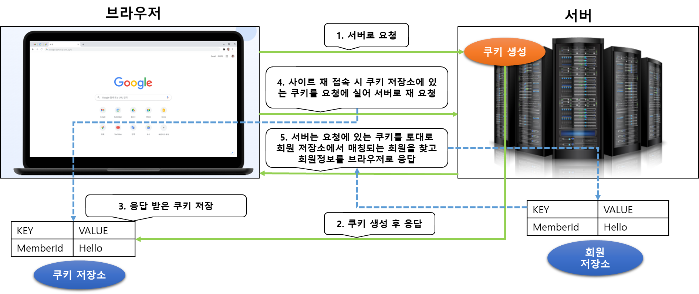
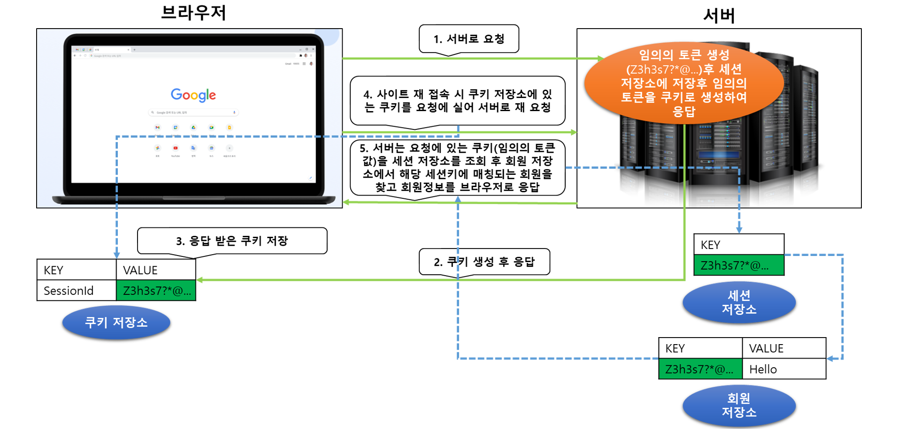
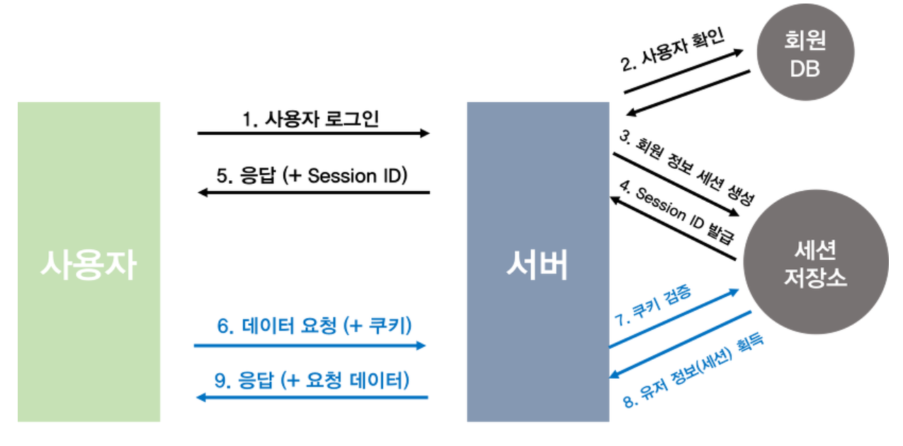
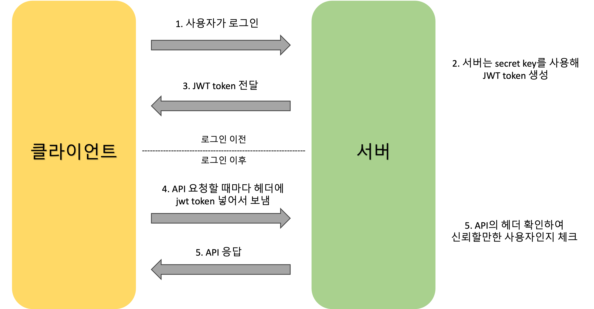

# 로그인

## 학습 키워드

- 로그인 인증 방식
  - HTTP 통신
  - Cookie
  - Session
  - Token(JWT)
- 로그인 기능 구현

<br/>

## 로그인 인증 방식

### HTTP 통신을 통해 유저 인증 받는 과정

`HTTP`는 인터넷상의 데이터를 주고 받기 위한 서버/클라이언트 모델을 따르는 프로토콜이다.
HTTP는 한번 통신이 일어나고 나면 `연결이 끊어지고` 다시 연결을 해도 `이전 상태를 유지하지 않아` 과거에 어떤 정보를 보냈었는지 기억하지 못한다는 특징을 가지고 있다.

> Connectionless : 한 번 통신이 이뤄지고 난 후에 연결이 바로 끊어진다. <br>
Stateless : 이전 상태를 유지/기억하지 않는다.

즉, 위의 특성 때문에 화면을 이동하며 새로운 API를 요청하면 다시 신뢰할만한 사용자인지 인증하는 과정을 매번 거처야한다.
매번 서버에게 사용자 누구인지 인증하는 과정은 번거롭고 귀찮을 뿐만 아니라 매번 요청을 보내야 하기 때문에 웹 페이지는 느려지는 원인이 된다.

이와 같은 문제점을 해결하여 로그인을 유지 시킬 방법으로는 `Cookie`, `Sesstion`, `Token`이 있다.

<br/>

### 🍪 Cookie

>클라이언트가 웹사이트를 방문할 경우, 그 사이트가 사용되고 있는 서버를 통해 클라이언트의 브라우저에 설치되는 작은 기록 파일을 의미

1. 웹사이트는 접속하면 브라우저는 서버로 요청을 보내는데 서버에서는 해당 요청에 대한 `응답헤더`의 `Set-Cookie`를 만들어 브라우저로 보낸다.
2. 해당 브라우저는 응답받은 쿠키를 쿠키저장소에 보관하게 된다.
3. 이후 다시 유저가 웹사이트에 접하게 되면 쿠키 저장소에서 이전에 서버에서 발급해준 쿠키정보를 `요청헤더`의 `Cookie`에 담아 보내게 된다.
4. 서버에서 이 쿠키값을 확인하여 해당 요청의 클라이언트가 누군지 식별할 수 있다.



#### Cookie 단점

- `보안에` 취약하다.
  - 쿠키의 값을 임의로 변경 할 수 있다. (개발자도구에서 쿠키를 변경 할수 있고, 클라이언트에서 강제로 변경하면 다른 사용자인 것 처럼 사용 가능)
  - 쿠키에 보관된 정보는 훔쳐갈 수 있다.
- `용량제한이 있어` 많은 정보는 담을 수 없다.  
- 웹 브라우저마다 쿠키에 대한 `지원형태가 다르기에` 브라우저 간 공유가 불가능 하다.
- 쿠기의 사이즈가 커질수록 네트워크 부하가 심해진다.

<br/>

### 🗃️ Session

> 비밀번호 등 클라이언트의 인증정보를 서버측에 저장하고 관리한다.

서버에서 예측 불가능한 임의의 토큰(랜덤값)을 쿠키로 생성하여 클라이언트에게 응답하고 서버에서는 해당 임의의 토큰값을 가지는 쿠키를 전달받아 사용자의 정보를 매핑하여 관리한다.

만약 해커가 임의의 토큰(랜덤값)을 가지는 쿠키를 털어간다고 해도 일정한 시간이 지나면 사용할 수 없도록 서버에서는
해당 토큰값에 대해 유효시간을 설정하여 해당 유효시간이 지날경우 토큰 정보를 삭제하고, 또한 해킹이 의심되는 경우 서버에서 해당 토큰을 강제로 제거한다.





#### Session 장점

- 서버가 클라이언의 웹 브라우저에 의존하지 않아도 된다.
- 쿠키를 포함한 요청이 외부에 노출되어도 세션ID 자체는 유의미한 개인 정보를 담지 않는다.
- 각 사용자마다 고유한 세선 ID가 발급되기 때문에, 요청이 들어올 때마다 회원정보를 확인할 필요가 없다.

#### Session 단점

- 서버에서 세션 저장소를 사용하기 때문에, 요청이 많아지면 서버에 부하가 생긴다.

<br/>

### 📬 Token

#### 🤔 JWT Token은 무엇일까?

> JWT(Json Web Token)은 Json객체에 인증에 필요한 정보들을 담은 후 비밀키로 서명한 토큰

- [인터넷 표준 인증 방식](https://datatracker.ietf.org/doc/html/rfc7519)
- 공식적으로 인증(Authentication) & 권한허가(Authorization) 방식으로 사용

#### JWT 프로세스



1. 사용자가 아이디와 비밀번호 혹은 소셜 로그인을 이용하여 서버에 `로그인 요청`
2. 서버는 `비밀키`를 사용해 Json 객체를 암호화한 `JWT 발급`
3. JWT을 헤더에 담아 클라이언트에 보낸다.

여기까지가 JWT을 발급받기까지의 과정, 로그인 이후에는

1. 클라이언트는 JWT을 `브라우저 저장소` 저장해둔다.
2. 로그인 정보가 필요한 API Call마다 header에 토큰을 실어서 보낸다.
3. 서버에서는 사용자가 보낸 토큰을 공개키로 서명을 체크하고 안에 담긴 정보를 확인한다.
4. 인증되면 API에 대한 응답을 보낸다.

#### JWT의 구조

- JWT는 `header`, `payload`, `signature` 3개로 구성

#### 📌 header

```
{
  "alg": "서명 시 사용하는 알고리즘 (signature에서 사용하는 알고리즘)",
 "kid": "서명 시 사용하는 키를 식별하는 값",
       "type": "토큰타입"
}
```

- JWT를 __어떻게 검증하는지에__ 대한 내용이 들어가 있다.
- 토큰타입, 암호화 알고리즘이 어떤 알고리즘인지에 대한 정보가 들어 있다.

#### 📌 payload

```
{
 "sub": "hyeonsu.jung",
     "exp": 1623235123,
     "iat": 1532341234
}

sub : 토큰 제목(subject)
aud : 토큰 대상자(audience)
iat : 토큰이 발급된 시각 (issued at)
exp : 토큰의 만료 시각 (expired)
```

- 토큰에 담아서 우리가 보내고자 하는 데이터가 이곳에 담겨있다.
- 이 정보에 대해서는 `클레임(claim)` 이라고 하고, `key-value`의 한 쌍으로 이루어져 있다.
- 여러개의 클레임을 담을 수 있고, 클레임을 공개 혹은 비공개 할 것인지 등록할 것인지 정할 수 있다.

#### 📌 signature

- 헤더와 페이로드의 문자열을 합친 후에, 헤더에서 선언한 알고리즘과 key를 이용해 암호한 값이다.
- Header와 Payload는 단순히 Base64url로 인코딩되어 있어 누구나 쉽게 복호화할 수 있지만, Signature는 key가 없으면 복호화할 수 없다.

#### JWT 장점

- Header와 Payload를 가지고 Signature를 생성하므로 데이터 위변조를 막을 수 있다.
- 확장성이 우수하다.
  - 토큰 기반으로 다른 로그인 시스템에 접근 및 권한 공유가 가능하다.
  - `OAuth`의 경우 Facebook, Google 등 소셜 계정을 이용해 다른 웹서비스에서도 로그인 할 수 있다.
- 모바일 어플리케이션 환경에서도 잘 동작한다.

#### JWT 단점

- 쿠키/세션과 다르게 토큰의 길이가 길어, 인증 요청이 많을수록 네트워크 부하가 심해진다.
- `payload`자체는 암호화 되지 않기 때문에 유저의 중요한 정보는 담을 수 없다. (패스워드 등)
- 토큰을 탈취당하면 대처하기 어렵다. 토큰은 한번 발급되면 유효기간이 만료될 때 까지 사용이 가능하다.
- 특정 사용자의 접속을 강제로 만료하기 어렵다.

#### 🗳️ 클라이언트가 토큰을 관리하는 방법

- 토큰을 유지하는 방법에는 다양한 브라우저 저장소에 저장하는 방법이 있다.
  - 비공개 변수, 로컬 스토리지, 세션 스토리지, 쿠키 등이 있다.
- 브라우저 저장소에 저장하면 보안 이슈가 있다.
  - React를 사용하면 XSS공격을 어느정도 막아준다고 한다. 완벽한 방법은 아니다.

<br/>

## 로그인 기능 구현

프론트엔드 입장에서 로그인은 사용자의 usename, password 정보를 서버로 전송해서 서버로부터 유저에 대해 인증을 받는 과정
(JTW를 얻는 과정)

### LoginPage

- 서버로부터 Access Token 얻어 usehooks-ts의 useLocalStorage를 사용해서 전역적으로 동기화
- `useLoginFormStore` 사용해서 Access Token이 바뀌었을 때(로그인 시) 홈(/)으로 리다이렉션

```
- LoginPage
  - useLoginFormStore
    - LoginFormStore
  - LoginForm
    - TextBox
```

<br/>

### 로그인 관련 store

- src/hooks/useLoginFormStore.ts
- src/stores/LoginFormStore.ts

<br/>

### 로컬 스토리지 사용을 위한 `useAccessToken` hook 생성

- Access Token 관리 기술을 감추기 위해 hook 사용
- usehooks-ts의 useLocalStorage를 사용

> 🤔 LocalStorage 토근을 저장하는 방식은 보안상 문제가 생길 수 있음.(XSS 공격) 그렇다면 어떻게 클라이언트 측에서 토큰을 가지고 있어야 할 때 어떤 방식으로 가지고 있어야 할까?

```ts
// useAccessToken.ts
import { useLocalStorage } from 'usehooks-ts';

export default function useAccessToken() {
  const [accessToken, setAccessToken] = useLocalStorage('accessToken', '');

  useEffect(() => {  // 로컬스토리지의 토큰값을 얻어 API call 할때 header 넣어주는 역활
    apiService.setAccessToken(accessToken);
  }, [accessToken]);

  return { accessToken, setAccessToken };
}
```

> 👩🏻‍💻 시도 useLocalStorage를 사용하지 않고 직접 구현하려고 했으나, 로컬스토리지 갱신한면서 화면이 업데이트 되지 않았음.

<br/>

### 로그인 API 호출 메서드 추가

- src/services/ApiService.ts

<br/>

### 로그인 여부에 따라 UI 변경

- GNB 구성이 바뀌도록 Header 변경
- `addToCartForm` 조건처리

<br/>

### API 호출할 때 AccessToken 사용

- src/services/ApiService.ts
- `setAccessToken` 메서드를 추가해서 API 호출할 때 Access Token 전달하게 한다.
  - Axios 인스턴스를 다시 만들어 주는 방식으로 처리
  - 해당 메소드가 사용되는 파일은 `/src/hooks/useAccessToken.tsx` hooks

<br/>

### AccessToken 확인

- 사이트를 로그인해서 처음 진입 했을 경우, AccessToken 확인하고 `사용자 정보`를 얻는 작업을 수행한다.
- 로그인한 회원정보 얻기

#### API 호출 해서 현재 사용자 id, name 을 얻기

- src/services/ApiService.ts
- `fetchCurrentUser` 메서드 추가

#### 확인을 위한 hook 생성

- useCheckAccessToken

<br/>

## 🔗 참고

- [쿠키, 세션, 토큰(JWT) 몰라도 괜찮겠어?](https://velog.io/@whitebear/쿠키-세션-토큰JWT-확실히-알고-가기)
- [알고 쓰자, JWT(Json Web Token).](https://velog.io/@chuu1019/알고-쓰자-JWTJson-Web-Token)
- [로그인 구현 - 쿠키와 세션](https://velog.io/@won-developer/로그인-구현-쿠키와-세션-n3wwrtip)
- [프론트에서 안전하게 로그인 처리하기](https://velog.io/@yaytomato/프론트에서-안전하게-로그인-처리하기)
- [JWT의 Refresh Token과 Access Token은 어디에 저장해야 할까?](https://blogeon.tistory.com/entry/JWT%EC%9D%98-Refresh-Token%EA%B3%BC-Access-Token%EC%9D%80-%EC%96%B4%EB%94%94%EC%97%90-%EC%A0%80%EC%9E%A5%ED%95%B4%EC%95%BC-%ED%95%A0%EA%B9%8C)
- [[네트워크] HTTP 쿠키와 세션이란 ?](https://noahlogs.tistory.com/38)
- [JWT 토큰 저장 방식?/위치? 정리 (보안)](https://dreamcode.tistory.com/444)
- [Access Token과 Refresh Token을 어디에 저장해야 할까?](https://velog.io/@ohzzi/Access-Token%EA%B3%BC-Refresh-Token%EC%9D%84-%EC%96%B4%EB%94%94%EC%97%90-%EC%A0%80%EC%9E%A5%ED%95%B4%EC%95%BC-%ED%95%A0%EA%B9%8C)
