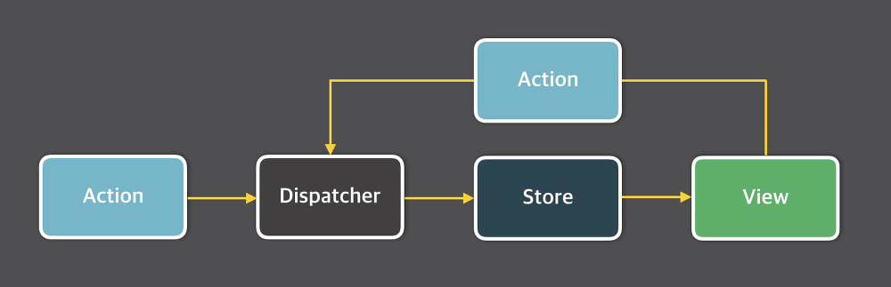

# External Store

## 학습키워드

- 관심사의 분리
- Architecture
  - Layered Architecture
  - Flux Architecture
    - `MVC 패턴`
- External Store

<br/>

## 관심사 분리

### 📖 관심사 분리([Separation of Concerns](https://ko.wikipedia.org/wiki/%EA%B4%80%EC%8B%AC%EC%82%AC_%EB%B6%84%EB%A6%AC))

> 컴퓨터 프로그램을 구별된 부분으로 분리시키는 디자인 원칙으로, 각 부문은 개개의 관심사를 해결한다.

하나의 모듈(혹은 함수)가 여러가지의 관심사를 가지고 처리하려면 복잡성이 높아지니 관심사를 여러개로 분리하여
__하나의 관심사는 하나의 기능을(역활만) 가지도록 구성한는 것__

### 🤔 관심사를 분리하는 이유는?!?

하나의 프로그램은 작은 부품이 모여서 만들어진다. React는 작은 컴포넌트들을 조립하여 더 큰 컴포넌트를 만드는 방식으로 개발하고 있다.

예를 들어, 아래와 같이 나타 낼 수 있다. 이는 `기능`을 위주로 분리했다.

```
├── App
│   ├── Header
│   ├── Main
│   │   ├── Greeting
│   │   ├── Counter
│   │   ├── Posts
│   │   └── PostForm
│   │         └── TextField 
│   ├── Footer
```

이런 식으로 분리하는 이유는 무엇일까?
서로의 `관심사`가 다르다.

예를 들어, App에서는 TextField가 어떻게 동작하는지 알 필요가 없다.
__각 부분은 하나의 역할, 하나의 관심사로 격리 됨으로써, 복잡도를 낮추게 된다.__

<br/>

## Architecture

> 시스템 아키텍처(system Architecture)는 시스템의 구조, 행위, 더 많은 뷰를 정의하는 개념적 모형이다. 시스템 목적을 달성하기 위해 시스템의 각 컴포넌트가 무엇이며 어떻게 상호작용하는지, 정보가 어떻게 교환되는지를 설명한다.

⇒ 즉,  __서비스의 동작 원리를 나타내는 것__ 을 의미한다.

<br/>

### 소프트웨어 아키텍처

- 시스템의 전체적인 구조와 구성요소들 간의 상호작용을 설계하는 것

시스템의 전체적인 동작을 결정하고, 시스템의 품질 성능(성능, 확작성, 유지보수성, 보안 등)에 직접적으로 영향을 미친다.

<br/>

### Layered Architecture

- 소프트웨어 시스템을 관심사 별로 여러개의 계층로 분리(계층화)한 아키텍처

> 각 계층은 어플리케이션 내에서 특정 역할과 책임이 있다. 그들은 자신의 역할에만 집중한다. __여기서 중요한 것은 구성 요소간 관심사가 분리되었다는 점이다.__


#### Layered Architecture 장점

- 코드의 재사용성 및 유지보수성
  - 각 계층이 관심사별로 분리되어 있으므로
- 변화에 유연하게 대처
  - 각 계층이 독립적으로 개발,확장,변경이 가능하다.
- 테스트 용이성
  - 각 계층이 독립적으로 테스트 가능하므로 단위 테스트나 통합 테스트 용이하게 수행

#### Layered Architecture 단점

- 오버헤드
  - 계층간의 통신을 통해 동작하기 떄문에,(단방향 의존성) 데이터의 전달 및 변화 과정에서 일부 오버헤드 발생
- 복잡성
  - 계층간의 통신을 위한 인터페이스와 로직을 추가해야하므로 복잡성이 증가

<br/>

### Flux Architecture

#### 🌎 Flux Architecture 탄생 배경


기존의 2-way binding(양방향 바인딩)을 썼을 때 생길 수 있는 Model-View의 복잡한 관계(전통적인 MVC에선 이런 상황을 지양)를 겨냥하여
Facebook(현 Meta)에서 MVC 패턴의 한계에 대안으로 내세운 아키텍처를 의미한다.

#### 🤔 2-way binding 양방향 바인딩?

> 📖 데이터(Data Binding)이란? <br/> 화면상에 보여지는 데이터(View)와 브라우저 메모리에 있는 데이터(Model)를 묶어서(Binding) 서로 간의 데이터를 동기화 하는 것을 의미한다.

Javascript(Model)와 HTML(View) 사이에 ViewModel이 존재하여 하나로 묶여서(Binding)되어서 둘 중 하나만 변경되어도 함께 변경되는 것을 의미한다.

HTML(View) 🔁 ViewModel 🔁 Javascript(Model)


#### 🤖 Flux 시스템의 구조



__unidirectional data flow(단방향 흐름)을__ 가지는 Architecture이다.<br/>
데이터의 흐름은 Dispatcher → Store → View 흐르고 View에서 입력이 발생하게 되면 Action을 통해 다시 Dispatcher로 향하게 된다.

- Action : 데이터 흐름에 변화를 주기 위한 동작 발생 → 이벤트/메시지 같은 객체
- Dispatcher : Action을 발송하는 역활 → (여러)Store로 Action을 전달
- Store : 데이터들을 저장한는 공간 → 받은 Action에 따라 상태를 변경/상태 변경을 알림.
  - Dispatcher를 통해 변화된 데이터가 Store 저장
- View : Store의 상태를 반영, 또 다른 Action을 전달 해준다.

```javascript
const state = {
  name : 'tester'
}

state.name = 'New Name' ❎
const nextState = {...state, name:'New Name'}; ✅
```

<br/>

## External Store

> External Store : (React 입장에서) Store가 React의 안에 있지 않는다를 의미한다.

### useState 로 상태 관리

Increase 버튼을 누르면 count 가 1씩 증가한다. 화면에도 증가되는 상태 값이 보인다.

```jsx
import { useState } from 'react';

export default function Counter() {
  const [count, setCount] = useState(0);

  const handleClick = () => {
    setCount(count + 1);
  };

  return (
    <div>
      <p>{count}</p>
      <button type="button" onClick={handleClick}>
        Increase
      </button>
    </div>
  );
}
```

### 🚨 일반적인 변수로 선언한 상태를 변경시 문제 발생

useState 사용하지 않고 일반적인 변수로 선언된 상태를 변경했지만 화면에 변화된 상태값이 반영되지 않는다.

```jsx

import { useEffect } from 'react';

let count = 0;

export default function Counter() {

  useEffect(() => {
    console.log(count);
  });

  const handleClick = () => {
    count += 1;
    //console.log(count);
  };

  return (
    <div>
      <p>{count}</p>
      <button type="button" onClick={handleClick}>
        Increase
      </button>
    </div>
  );
}
```

### useReducer를 통해 (feat.forceUpdate)

Class 컴포넌트를 쓰던 시절에는 forceUpdate 함수를 통해 강제로 리렌더링을 했다. 그러나
Function 컴포넌트는 useReducer hook을 사용해서 상태를 만들어 강제로 리렌더링 함으로서 해결

- [forceUpdate와 같은 것이 있습니까?](https://ko.legacy.reactjs.org/docs/hooks-faq.html#is-there-something-like-forceupdate)

```jsx

import { useEffect, useReducer } from 'react';

let count = 0;

export default function Counter() {

  // const [ignored, forceUpdate] = useReducer(x => x + 1, 0);
  const [, forceUpdate] = useReducer(x => x + 1, 0);

  useEffect(() => {
    console.log(count);
  });

  const handleClick = () => {
    count += 1;
    // 강제로 리렌더링
    forceUpdate();
  };

  return (
    <div>
      <p>{count}</p>
      <button type="button" onClick={handleClick}>
        Increase
      </button>
    </div>
  );
}
```

```jsx

import { useEffect, useReducer } from 'react';

let count = 0;

function reducer(state){
  // return state + 1;
  return {...state, x : state.x + 1 }
}

export default function Counter() {

  // const [ignored, forceUpdate] = useReducer(x => x + 1, 0);
  // const [, forceUpdate] = useReducer(reducer, 0);
  const [, forceUpdate] = useReducer(reducer, {x:0});

  useEffect(() => {
    console.log(count);
  });

  const handleClick = () => {
    count += 1;
    // 강제로 리렌더링
    forceUpdate();
  };

  return (
    <div>
      <p>{count}</p>
      <button type="button" onClick={handleClick}>
        Increase
      </button>
    </div>
  );
}
```

> 🤔 그러나 Counter 컴포넌트는 화면을 업데이는 하는 상태와 count를 변경하는 상태를
모두 가지고 있다.

### CustomHook으로 분리

화면을 렌더링 하는 useState를 CustomHook을 통해 분리했더니, React가 더이상 화면을 업데이트 하는 상태는 관리 하지 않게 되었다.
이런식으로 만드는게 __External Store의 기본적인 아이디어다.__

```jsx
// hooks/useForceUpdate.ts

import { useState} from 'react';

export default function useForceUpdate() {
  const [state, setState] = useState(0);

  const forceUpdate = () => {
    setState(state + 1);
  };

  return forceUpdate;
}
```

```jsx
// components/Counter.tsx

import useForceUpdate from '../hooks/useForceUpdate';

let count = 0;

export default function Counter() {
  const forceUpdate = useForceUpdate();

  const handleClick = () => {
    count += 1;
    forceUpdate();
  };

  return (
    <div>
      <p>{count}</p>
      <button type="button" onClick={handleClick}>
        Increase
      </button>
    </div>
  );
}
```

이런 접근을 통해서 React가 UI를 담당하고, 순수한 TypeScript(또는 Javascript)가 비즈니스 로직을 담당하는 __관심사 분리__ 통해 자주 바뀌는 UI 요소에 대한 테스트 대신, 오래 유지되는 비즈니스 로직에 대한 테스트 코드를 작성해 유지보수에 도움이 되는 테스트 코드를 치밀하게 작성 할 수 있다.

<br/>

## 🔗 참고

- [상태를 React 안에서 관리하지 않고, 외부에서 External Store 라는 형태로 관리하는 법에 대해 알아보자](https://velog.io/@jeong_lululala/external-store)
- [관심사 분리란?](https://leffept.tistory.com/401)
- [아키텍처(Architecture)란?](https://linsaeng.tistory.com/35)
- [레이어드 아키텍처(Layered Architecture)란?](https://xxeol.tistory.com/26)
- [Layered Architecture(계층화 아키텍처)란 무엇인가?](https://devmoony.tistory.com/178)
- [데이터 바인딩 이해하기(단방향, 양방향 데이터 바인딩)](https://adjh54.tistory.com/49)
- [양방향 바인딩?](https://velog.io/@sarahsea/양방향-바인딩)
- [FLUX 아키텍쳐란](https://velog.io/@alskt0419/FLUX-%EC%95%84%ED%82%A4%ED%85%8D%EC%B3%90%EB%9E%80)
- [Flux로의 카툰 안내서](https://bestalign.github.io/translation/cartoon-guide-to-flux/)
