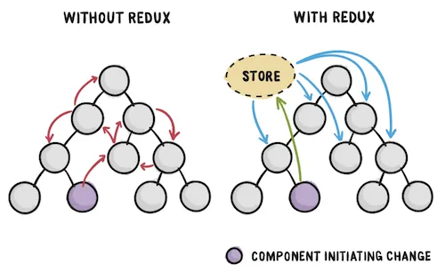
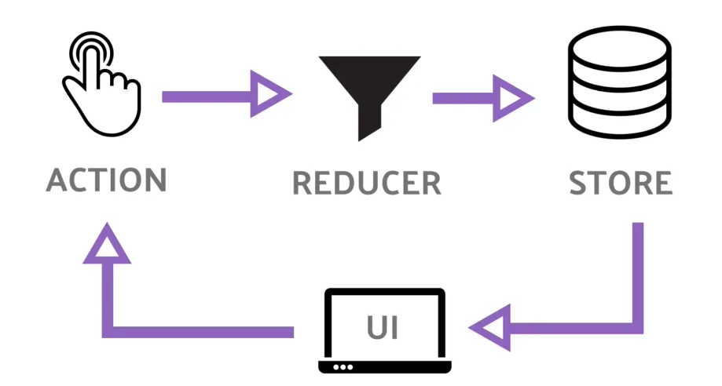
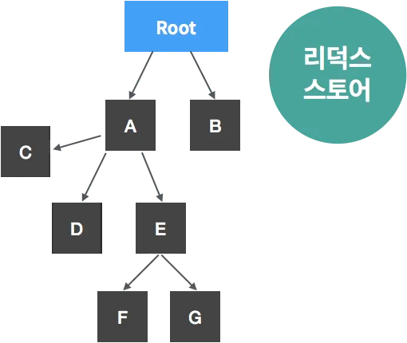
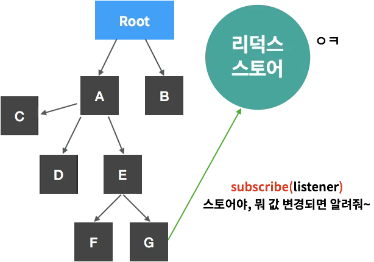
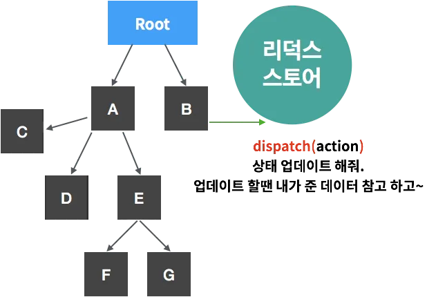
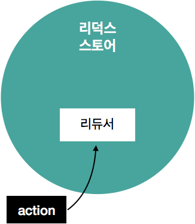
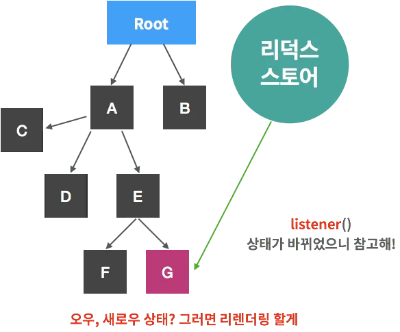

# Redux 따라하기

## 학습키워드

- Redux
- Reflect

<br/>

## Redux

- JavaScript 상태관리 라이브러리
- Redux의 본질은 Node.js 모듈이다.

### 🤔 Redux를 사용하는 이유는? (상태관리도구의 필요성)

#### 먼저 상태란 무엇이고 어떠한 특징을 가지고 있는가?

1. React에서 state(상태)는 component 내부(안)에서 관리 된다.
    - (useState, useReducer → Hook들은 component 내부에서만 사용 가능)
  
2. 자식 component들 간의 데이터를 주고 받고 싶다면 state(상태)를 관리하는 공통의 부모 component를 통해서 주고 받는다.
    - state(상태)는 자식 component들 간의 다이렉트 데이터 전달은 불가능 하다.
    - React의 데이터 흐름은 상위 component 에서 하위 component 로 전달되는 __단방향의 흐름을__ 가지고 있기 때문에

#### 사용하는 이유 1. state 종속성 탈피

useState를 사용 할 경우 __컴포넌트 내부에__ state를 만들고, setState 함수를 통해 state를 변경한다.
그렇기 때문에 state는 component에 종속 된다.

#### 사용하는 이유 2. props -> props -> props 지옥 탈출

자식 component들 많아지게 된다면 상태 관리가 매우 복잡해진다. 상태를 관리하는 상위 컴포넌트에서 계속 내려 받아야 한다.


> 💡 `Redux`를 사용하면 component에 종속되지 않고, 상태관리를 component에 바깥에서 관리 할 수 있게 된다.
프로젝트 루트레벨에서 `store` 라는 곳에 state를 저장하고, 모든 component는 store에 `구독`을 하면서 state와 state를 바꾸는 함수를 전달 받게 된다.



- 전역 상태 저장소 제공
- Props Drilling 이슈 해결

<br/>

### 🤖 Redux 3가지의 원칙

#### 1. Single source of truth

- 단 하나의 진실의 원천
- 동일한 데이터는 항상 같은 곳에서 가지고 온다.
- Redux에는 `Store` 하나뿐인 데이터 공간이 있다는 의미

#### 2. State is read-only

- 상태 값은 읽기 전용
- 첫번째 원칙에 따라 모든 상태의 값은 하나의 Source of truth에 저장된다.
그리고 여기서 필요한 상태의 값을 읽어서 사용하게 되는데, 상태값을 읽을 수만 있고 변경할 수는 없다.
만약 외부에서 이 상태값을 맘대로 변경할 수 있게 된다면, Single source of truth가 가지는 의미가 없게 된다.

#### 3. Changes are made with pure functions

- 변화는 순수 함수들을 통해 이뤄져야 한다.
- 상태의 변화를 일으키는 모든 함수는 입력값(input)을 변경하지 않으며, 같은 입력값에 대해서는 항상 같은 출력(output)값을 리턴해야 한다는 걸 의미한다.
- 상태의 변화를 일으키는 함수 `Reducer`은 순수 함수여야 한다.

> 📖 순수함수란? <br/> 입력값을 변경하지 않으면, 같은 입력값에 대해서는 항상 같은 출력값을 반환하는 함수

<br/>

### 🔁 Redux Data Flow

- [Flux 패턴](https://magrowing.gitbook.io/magrowing-gitbook/category/state_management/external_store#flux-architecture) 기반의 Data Flow




Redux의 데이터 흐름은 동일하게 단방향으로 View(컴포넌트)에서 Dispatch(store에서 주는 state를 바꾸는 함수)라는 함수를 통해 action(디스 패치 함수 이름)이 발동되고 reducer에 정의된 로직에 따라 store의 state가 변화하고 그 state를 쓰는 view(컴포넌트)가 변하는 흐름을 따른다.

<br/>

### ⚙️ Redux 구성요소

#### Store

- 데이터들을 저장하기 위한 저장소
- JavaScript 객체나 배열 같은 변수를 통해 데이터들을 관리 ( → 메모리에서 관리 )

#### State

- 상태를 의미
- Store에 저장 되어 있는 데이터
- React는 컴포넌트 내에서 존재하지만 Redux에서는 store 내에 존재

#### Action

- state에 변화를 주기 위한 핻옹
- Store에 저장된 데이터에 변화를 주기 위한 행동
- JavaScript 객체 형태로 존재

#### Action Creator

- Action을 생성하는 생성자 역활
- Action 객체를 생성하는 역할을 하는 JavaScript 함수

#### Reducer

- Action이 발생하면, Action을 실제로 처리하는 역할을 하는 함수
- State에 변화를 주는 역할

> 📖  Reduce는 줄이다, 축소하다 라는 의미  __Reducer는, 축소하는 역할을 하는 것__ <br/> 컴퓨터 프로그래밍 분야에서 Reduce라고 하면 __입력에 어떤 처리를 해서, 원하는 결과로 축소시키는 과정이라는 의미__

<br/>

### Redux의 상태관리 과정

#### 1. 스토어 설정



Redux를 프로젝트에 적용하게 되면 store 저장소가 생성된다. store 안에는 프로젝트의 상태에 관한 데이터들이 담겨져 있다.

#### 2. 컴포넌트의 스토어 구독



컴포넌트는 store에 구독을 한다. 구독을 하는 과정에서, 특정 함수가 store한테 전달이 된다.
나중에 store의 state 값이 변동이 생긴다면 전달 받았던 함수를 호출한다.

#### 3. 스토어에 상태 변경하라고 알려주기



B컴포넌에서 이벤트가 생겨서 상태를 변화 할 일이 생겼다. 이때 `dispatch(Action)` 함수를 통해 Action을 전달해준다.
Action은 상태에 변화를 일으킬 때 __참조 할 수 있는 객체다.__ 액션 객체는 필수적으로 type 라는 값을 가지고 있어야 한다.

#### 4. Reducer를 통하여 상태를 변화시키기



Action 객체를 받으면 전달받은 Action의 type에 따라 어떻게 상태를 업데이트 해야 할지 정의를 해줘야 한다. 이러한 업데이트 로직을 정의하는 함수를 `Reducer`라고 부른다.

```javascript
function reducer(state, action) {
  // ... 새로운 상태의 객체 반환
}
```

#### 5. 상태가 변화가 생기면, 구독하고 있던 컴포넌트에게 알림



상태에 변화가 생기면, 이전에 컴포넌트가 스토어한테 구독 할 때 전달해줬었던 함수 listener함수가 호출된다. 이를 통하여 컴포넌트는 새로운 상태를 받게되고, 이에 따라 컴포넌트는 리렌더링을 한다.

<br/>

### Redux의 장점

- 상태를 예측 가능하게 만든다. (순수함수를 사용하기 때문)
- 유지보수 (복잡한 상태 관리와 비교)
  - 디버깅에 유리 (action과 state log 기록 시) → redux dev tool (크롬 확장)
- 테스트를 붙이기 용의 (순수함수를 사용하기 때문)

<br/>

## 🔗 참고

- [React에서 Redux가 왜 필요할까?](https://devlog-h.tistory.com/26)
- [react-redux 사용법](https://kyounghwan01.github.io/blog/React/redux/redux-basic/#%E1%84%89%E1%85%A1%E1%84%8B%E1%85%AD%E1%86%BC%E1%84%92%E1%85%A1%E1%84%82%E1%85%B3%E1%86%AB-%E1%84%8B%E1%85%B5%E1%84%8B%E1%85%B2)
- [Redux(리덕스)란?](https://hanamon.kr/redux%EB%9E%80-%EB%A6%AC%EB%8D%95%EC%8A%A4-%EC%83%81%ED%83%9C-%EA%B4%80%EB%A6%AC-%EB%9D%BC%EC%9D%B4%EB%B8%8C%EB%9F%AC%EB%A6%AC/)
- [Redux와 사용법](https://medium.com/@heoh06/리액트-redux와-사용법-731853fc3cd4)
- [처음 만난 Redux 구성요소](https://www.frontoverflow.com/document/1/%EC%B2%98%EC%9D%8C%20%EB%A7%8C%EB%82%9C%20%EB%A6%AC%EB%8D%95%EC%8A%A4%20(Redux)/chapter/3/Redux%20%EC%8B%9C%EC%9E%91%ED%95%98%EA%B8%B0/section/10/Redux%20%EA%B5%AC%EC%84%B1%EC%9A%94%EC%86%8C)
- [리덕스(Redux)를 왜 쓸까? 그리고 리덕스를 편하게 사용하기 위한 발악](https://velopert.com/3528)
