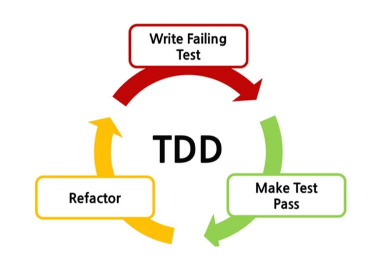

# TDD

## 학습 키워드

- TDD
  - 단위 테스트(Unit Test)

 

## TDD(Test Driven Development)

- [테스트 주도 개발](https://wiki.c2.com/?CodeUnitTestFirst)
- 테스트가 전체 개발을 주도해 내가는 것 ⇒ __비지니스 코드를 먼저 작성하는 것이 아닌 테스트가 중심이 되어 전체 개발 방향을 이끌고 나가는 것__

> 반복 테스트를 이용한 소프트웨어 방법론으로, __작은 단위의 테스트 케이스를 작성하고 이를 통과하는 코드를 추가하는 단계를 반복하여 구현한다.__

### 📖 단위 테스트(Unit Test)란?

- 컴퓨터 프로그래밍에서 소스 코드의 특정 모듈이 의도된 대로 정확히 작동하는지 검증하는 절차이다.

회사에서 혹은 개인이 어떠한 기능을 위해서 작성했던 프로그램 안에 있는 모든 함수와 메소드가 믿을만한 코드인가에 대한 테스트 케이스를 작성하는 절차를 말한다.

 

### 🤔 왜 TDD를 해야 할까? TDD의 필요성

- 코드를 작성하기전 __설계에 대해 구체적으로 작성이__ 가능하다.

> 코드를 작성하기 이전에 어떻게 구현할지 계획하고 구상한다.
`TDD`는 이러한 설계를 강제하게 만들며 보다 구체적으로 동작에 대해 서술함으로써 __내가 무엇을 만들어야 하는지 어떤 기능을 만들어야 하는지 명확하게 파악할 수 있다.__

- __오류에 대해 신속한 파악이 가능하며,__ 디버깅 시간을 단축시킨다.

> `테스트 코드`는 이에 대해 어떤 부분이 어디까지 통과를 했는지 어느 부분에 문제가 발생했는지 명확하게 알 수 있으므로 신속한 파악이 가능하다.

- 커뮤니케이션 측면에서 __코드 작성 의도 파악 가능__ (문서의 대체 가능)

> 우리는 코드를 읽다 보면 때론 무슨 의미인지 모를때가 있다.이를 위해 주석을 다는 경우도 있고 해당 코드를 작성한 사람을 찾아가거나 또는 작성한 문서를 보고는 한다. `테스트 코드`는 설계를 할 당시에 어떤 의도를 가지고 작성되었는지 그리고 어떤 결과 값이 나오길 기대하는지를 적기 때문에 코드를 쓴 사람의 의도를 충분히 파악할 수 있다.

 

### ♻️ TDD Cycle

- __Red__ → 실패하는 테스트 코드를 작성한다.
- __Green__ → 테스트 코드를 성공시키기 위한 코드(Test Pass)를 작성한다.(올바른 방법이 아니어도 괜찮다.)
- __Refactor__ → 중복 코드 제거, 일반화 등의 리팩토링(Refactor)을 수행한다. (TDD에서 가장 중요한 부분이지만, 간과될 때가 많다.)

 

### ✍🏻 TDD 정리

- TDD는 테스트 주도 개발을 뜻하며 테스트가 중심이 되어 전체 개발의 방향을 이끌어 가는 소프트웨어 개발 방법론 중 하나이다.
- 기능을 구현하는 과정에서 설계를 테스트 함으로써 안정성 있는 제품을 만드는데 기여하고 디버깅 시간을 단축해주고 코드의 의도를 명확히 알 수 있다.

 

### 🔗 참고

- [TDD FAQ](https://github.com/ahastudio/til/blob/main/blog/2016/12-03-tdd-faq.md)
- [TDD란 무엇인가?](https://velog.io/@cmin95/TDD란-무엇인가)
- [TDD란 무엇이며 왜 필요한가?](https://jay-flow.medium.com/tdd란-무엇이며-왜-필요한가-18cb5979629c)
